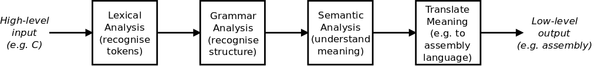

# Part 0: Introduction

I've decided to go on a compiler writing journey. In the past I've written some
[assemblers](https://github.com/DoctorWkt/pdp7-unix/blob/master/tools/as7), and
I've written a [simple compiler](https://github.com/DoctorWkt/h-compiler)
for a typeless language. But I've never written a compiler that can compile
itself. So that's where I'm headed on this journey.

As part of the process, I'm going to write up my work so that others can
follow along. This will also help me to clarify my thoughts and ideas.
Hopefully you, and I, will find this useful!

## Goals of the Journey

Here are my goals, and non-goals, for the journey:

 + To write a self-compiling compiler. I think that if the compiler can
   compile itself, it gets to call itself a *real* compiler.
 + To target at least one real hardware platform. I've seen a few compilers
   that generate code for hypothetical machines. I want my compiler to
   work on real hardware. Also, if possible, I want to write the compiler
   so that it can support multiple backends for different hardware platforms.
 + Practical before research. There's a whole lot of research in the area of
   compilers. I want to start from absolute zero on this journey, so I'll
   tend to go for a practical approach and not a theory-heavy approach. That
   said, there will be times when I'll need to introduce (and implement) some
   theory-based stuff.
 + Follow the KISS principle: keep it simple, stupid! I'm definitely going to
   be using Ken Thompson's principle here: "When in doubt, use brute force."
 + Take a lot of small steps to reach the final goal. I'll break the journey
   up into a lot of simple steps instead of taking large leaps. This will
   make each new addition to the compiler a bite-sized and easily digestible
   thing.

## Target Language

The choice of a target language is difficult. If I choose a high-level
language like Python, Go etc., then I'll have to implement a whole pile
of libraries and classes as they are built-in to the language.

I could write a compiler for a language like Lisp, but these can be
[done easily](ftp://publications.ai.mit.edu/ai-publications/pdf/AIM-039.pdf).

Instead, I've fallen back on the old standby and I'm going to write a
compiler for a subset of C, enough to allow the compiler to compile
itself.

C is just a step up from assembly language (for some subset of C, not
[C18](https://en.wikipedia.org/wiki/C18_(C_standard_revision))), and this
will help make the task of compiling the C code down to assembly somewhat
easier. Oh, and I also like C.

## The Basics of a Compiler's Job

The job of a compiler is to translate input in one language (usually
a high-level language) into a different output language (usually a
lower-level language than the input). The main steps are:



 + Do [lexical analysis](https://en.wikipedia.org/wiki/Lexical_analysis)
to recognise the lexical elements. In several languages, `=` is different
to `==`, so you can't just read a single `=`. We call these lexical
elements *tokens*.
 + [Parse](https://en.wikipedia.org/wiki/Parsing) the input, i.e. recognise
the syntax and structural elements of the input and ensure that they
conform to the *grammar* of the language. For example, your language
might have this decision-making
structure:

```
      if (x < 23) {
        print("x is smaller than 23\n");
      }
```

> but in another language you might write:

```
      if (x < 23):
        print("x is smaller than 23\n")
```

> This is also the place where the compiler can detect syntax errors, like if
the semicolon was missing on the end of the first *print* statement.

 + Do [semantic analysis](https://en.wikipedia.org/wiki/Semantic_analysis_(compilers))
   of the input, i.e. understand the meaning of the input. This is actually different
   from recognising the syntax and structure. For example, in English, a
   sentence might have the form `<subject> <verb> <adjective> <object>`.
   The following two sentences have the same structure, but completely
   different meaning:

```
          David ate lovely bananas.
          Jennifer hates green tomatoes.
```

 + [Translate](https://en.wikipedia.org/wiki/Code_generation_(compiler))
   the meaning of the input into a different language. Here we
   convert the input, parts at a time, into a lower-level language.
  
## Resources

There's a lot of compiler resources out on the Internet. Here are the ones
I'll be looking at.

### Learning Resources

If you want to start with some books, papers and tools on compilers,
I'd highly recommend this list:

  + [Curated list of awesome resources on Compilers, Interpreters and Runtimes](https://github.com/aalhour/awesome-compilers) by Ahmad Alhour

### Existing Compilers

While I'm going to build my own compiler, I plan on looking at other compilers
for ideas and probably also borrow some of their code. Here are the ones
I'm looking at:

  + [SubC](http://www.t3x.org/subc/) by Nils M Holm
  + [Swieros C Compiler](https://github.com/rswier/swieros/blob/master/root/bin/c.c) by Robert Swierczek
  + [fbcc](https://github.com/DoctorWkt/fbcc) by Fabrice Bellard
  + [tcc](https://bellard.org/tcc/), also by Fabrice Bellard and others
  + [catc](https://github.com/yui0/catc) by Yuichiro Nakada
  + [amacc](https://github.com/jserv/amacc) by Jim Huang
  + [Small C](https://en.wikipedia.org/wiki/Small-C) by Ron Cain,
    James E. Hendrix, derivatives by others

In particular, I'll be using a lot of the ideas, and some of the code,
from the SubC compiler.

## Setting Up the Development Environment

Assuming that you want to come along on this journey, here's what you'll
need. I'm going to use a Linux development environment, so download and
set up your favourite Linux system: I'm using Lubuntu 18.04.

I'm going to target two hardware platforms: Intel x86-64 and 32-bit ARM.
I'll use a PC running Lubuntu 18.04 as the Intel target, and a Raspberry
Pi running Raspbian as the ARM target.

On the Intel platform, we are going to need an existing C compiler.
So, install this package (I give the Ubuntu/Debian commands):

```
  $ sudo apt-get install build-essential
```

If there are any more tools required for a vanilla Linux
system, let me know.

Finally, clone a copy of this Github repository.

## The Next Step

In the next part of our compiler writing journey, we will start with
the code to scan our input file and find the *tokens* that are the
lexical elements of our language. [Next step](../01_Scanner/Readme.md)
