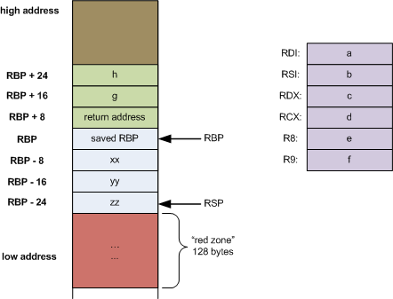

# Part 24: Function Parameters 

I've just implemented the copying of function parameters out of the
registers and onto the function's stack, but I haven't yet implemented
the calling of a function with arguments.

As a recap, here is the image from Eli Bendersky's article on the
[stack frame layout on x86-64](https://eli.thegreenplace.net/2011/09/06/stack-frame-layout-on-x86-64/).



Up to six "call by value" arguments to a function are passed in via the
registers '%rdi' to '%r9'. For more than six arguments, the remaining arguments
are pushed on the stack.

When the function is called, it pushes the previous stack base pointer
onto the stack, moves the stack base pointer down to point at the same
location as the stack pointer, and then moves the stack pointer to
the lowest local variable (at minimum).

Why "at minimum"? Well, 
we also have to lower the stack pointer down to be a multiple of sixteen,
so that the stack base pointer is aligned correctly before we call
another function.

The arguments which were pushed on the stack are going to remain there,
with an offset from the stack base pointer which is positive. All the
register-passed arguments we will copy onto the stack, and also set up
locations on the stack for our local variables. These will have
offsets from the stack base pointer which are negative.

This is the goal, but we have to get a few things done first.

## New Tokens and Scanning

To start with, function declarations in ANSI C are a comma-separated
list of types and variable names, e.g.

```c
int function(int x, char y, long z) { ... }
```

Thus, we need a new token, T_COMMA, and a change to the lexical scanner
to read it in. I'll leave you to read the changes to `scan()` in `scan.c`.

## A New Storage Class

In the last part of our compiler writing journey, I described the changes
to the symbol table to support both global and local variables. We store
globals at one end of the table, and locals at the other end. Now, I'm
going to introduce function parameters.

I've added a new storage class definition in `defs.h`:

```c
// Storage classes
enum {
        C_GLOBAL = 1,           // Globally visible symbol
        C_LOCAL,                // Locally visible symbol
        C_PARAM                 // Locally visible function parameter
};
```

Where will they appear in the symbol table? Actually, the same parameter
will appear in both the global and the local end of the table.

In the global symbol list, we will define the function's symbol first with
an C_GLOBAL, S_FUNCTION entry. Then, we will define all the parameters with
consecutive entries that are marked as C_PARAM. This is the function's
*prototype*. It means that, when we call the function later, we can
compare the argument list to the parameter list and ensure that they match.

At the same time, the same list of parameters are stored in the local
symbol list, marked as C_PARAM instead of C_LOCAL. This allows us to
distinguish between the variables someone else sent to us, and the
variables we declared ourselves.

## Changes to the Parser

In this part of the journey, I'm only dealing with function declarations.
We will need to modify the parser to do this. Once we have parsed the
function's type, name and the opening '(', we can look for any parameters.
Each parameter is declared following the normal variable declaration
syntax, but instead of ending with a semicolon, the parameter declarations are
separated from commas.

The old `var_declaration()` function in `decl.c` used to scan in the T_SEMI
token at the end of a variable declaration. This has now been moved out to
the previous callers of `var_declaration()`.

We now have a new function, `param_declaration()` whose job is to read the
list of (zero or more) parameters that follow after the opening parenthesis:

```c
// param_declaration: <null>
//           | variable_declaration
//           | variable_declaration ',' param_declaration
//
// Parse the parameters in parentheses after the function name.
// Add them as symbols to the symbol table and return the number
// of parameters.
static int param_declaration(void) {
  int type;
  int paramcnt=0;

  // Loop until the final right parentheses
  while (Token.token != T_RPAREN) {
    // Get the type and identifier
    // and add it to the symbol table
    type = parse_type();
    ident();
    var_declaration(type, 1, 1);
    paramcnt++;

    // Must have a ',' or ')' at this point
    switch (Token.token) {
      case T_COMMA: scan(&Token); break;
      case T_RPAREN: break;
      default:
        fatald("Unexpected token in parameter list", Token.token);
    }
  }

  // Return the count of parameters
  return(paramcnt);
}
```

The two '1' arguments to `var_declaration()` indicate that this is a local
variable and also a parameter declaration. And in `var_declaration()`, we
now do:

```c
    // Add this as a known scalar
    // and generate its space in assembly
    if (islocal) {
      if (addlocl(Text, type, S_VARIABLE, isparam, 1)==-1)
       fatals("Duplicate local variable declaration", Text);
    } else {
      addglob(Text, type, S_VARIABLE, 0, 1);
    }
```

The code used to allow duplicate local variable declarations, but this is
now going to cause the stack to grow more than is needed, so I've made
any duplicate declaration a fatal error.

## Symbol Table Changes

Earlier on, I said that a parameter would be placed in both the global
and local ends of the symbol table, but the above code only shows a
call to `addlocl()`. So what's going on, then?

I've modified `addlocal()` to also add a parameter to the global end:

```c
int addlocl(char *name, int type, int stype, int isparam, int size) {
  int localslot, globalslot;
  ...
  localslot = newlocl();
  if (isparam) {
    updatesym(localslot, name, type, stype, C_PARAM, 0, size, 0);
    globalslot = newglob();
    updatesym(globalslot, name, type, stype, C_PARAM, 0, size, 0);
  } else {
    updatesym(localslot, name, type, stype, C_LOCAL, 0, size, 0);
  }
```

Not only do we get a local slot in the symbol table for a parameter,
we also get a global slot for it. And both are marked as C_PARAM,
not C_LOCAL.

Given that the global end now contains symbols which are not C_GLOBAL,
we need to modify the code to search for global symbols:

```c
// Determine if the symbol s is in the global symbol table.
// Return its slot position or -1 if not found.
// Skip C_PARAM entries
int findglob(char *s) {
  int i;

  for (i = 0; i < Globs; i++) {
    if (Symtable[i].class == C_PARAM) continue;
    if (*s == *Symtable[i].name && !strcmp(s, Symtable[i].name))
      return (i);
  }
  return (-1);
}
```

## x86-64 Code Generator Changes

That's about it for parsing function parameters and recording their
existence in the symbol table. Now we need to generate a suitable
function preamble that copies in-register arguments into positions
on the stack as well as setting up the new stack base pointer and
stack pointer.

I realised, after I'd written the `cgresetlocals()` in the last part,
than I can reset the stack offset when I call `cgfuncpreamble()`, so
I've removed this function. Also, the code to calculate an offset for
a new local variable only needs to be visible in `cg.c`, so I've
renamed it:

```c
// Position of next local variable relative to stack base pointer.
// We store the offset as positive to make aligning the stack pointer easier
static int localOffset;
static int stackOffset;

// Create the position of a new local variable.
static int newlocaloffset(int type) {
  // Decrement the offset by a minimum of 4 bytes
  // and allocate on the stack
  localOffset += (cgprimsize(type) > 4) ? cgprimsize(type) : 4;
  return (-localOffset);
}
```

I've also switched from calculating a negative offset to calculating a
positive offset, as this makes the maths (in my head) easier. I still
return a negative offset as shown by the return value.

We have six new register that are going to hold argument values, so we
had better name them somewhere. I've extended the list of register names
thus:

```c
#define NUMFREEREGS 4
#define FIRSTPARAMREG 9         // Position of first parameter register
static int freereg[NUMFREEREGS];
static char *reglist[] =
  { "%r10", "%r11", "%r12", "%r13", "%r9", "%r8", "%rcx", "%rdx", "%rsi",
"%rdi" };
static char *breglist[] =
  { "%r10b", "%r11b", "%r12b", "%r13b", "%r9b", "%r8b", "%cl", "%dl", "%sil",
"%dil" };
static char *dreglist[] =
  { "%r10d", "%r11d", "%r12d", "%r13d", "%r9d", "%r8d", "%ecx", "%edx",
"%esi", "%edi" };
```

FIRSTPARAMREG is actually the last entry position in each list. We will 
start at this end and work backwards.

Now we turn our attention to the function that's going to do all the work
for us, `cgfuncpreamble()`. Let's look at the code in stages:

```c
// Print out a function preamble
void cgfuncpreamble(int id) {
  char *name = Symtable[id].name;
  int i;
  int paramOffset = 16;         // Any pushed params start at this stack offset
  int paramReg = FIRSTPARAMREG; // Index to the first param register in above reg lists

  // Output in the text segment, reset local offset
  cgtextseg();
  localOffset= 0;

  // Output the function start, save the %rsp and %rsp
  fprintf(Outfile,
          "\t.globl\t%s\n"
          "\t.type\t%s, @function\n"
          "%s:\n" "\tpushq\t%%rbp\n"
          "\tmovq\t%%rsp, %%rbp\n", name, name, name);
```

First up, declare the function, save the old base pointer and move it
down to where the current stack pointer is. We also know that any
on-stack arguments will be 16 above the new base pointer, and we know
which will be the register with the first parameter in it.

```c
  // Copy any in-register parameters to the stack
  // Stop after no more than six parameter registers
  for (i = NSYMBOLS - 1; i > Locls; i--) {
    if (Symtable[i].class != C_PARAM)
      break;
    if (i < NSYMBOLS - 6)
      break;
    Symtable[i].posn = newlocaloffset(Symtable[i].type);
    cgstorlocal(paramReg--, i);
  }
```

This loops up to six times, but leaves the loop once we hit something
that isn't a C_PARAM, i.e. a C_LOCAL. Call `newlocaloffset()` to
generate an offset from the base pointer on the stack, and copy
the register argument to this location on the stack.

```c
  // For the remainder, if they are a parameter then they are
  // already on the stack. If only a local, make a stack position.
  for (; i > Locls; i--) {
    if (Symtable[i].class == C_PARAM) {
      Symtable[i].posn = paramOffset;
      paramOffset += 8;
    } else {
      Symtable[i].posn = newlocaloffset(Symtable[i].type);
    }
  }
```

For each remaining local variable: if it's a C_PARAM, then it is already on
the stack, so simply record its existing position in the symbol table. If
it's a C_LOCAL, create a new position on the stack and record it.
We now have our new stack frame set up with all the local variables that
we need. All that is left is to align the stack pointer on a multiple of
sixteen:

```c
  // Align the stack pointer to be a multiple of 16
  // less than its previous value
  stackOffset = (localOffset + 15) & ~15;
  fprintf(Outfile, "\taddq\t$%d,%%rsp\n", -stackOffset);
}
```

`stackOffset` is a static variable visible throughout `cg.c`. We need to
remember this value as, at the function's postamble, we need to increase
the stack value by the amount that we lowered it, as well as restore the old
stack base pointer:

```c
// Print out a function postamble
void cgfuncpostamble(int id) {
  cglabel(Symtable[id].endlabel);
  fprintf(Outfile, "\taddq\t$%d,%%rsp\n", stackOffset);
  fputs("\tpopq %rbp\n" "\tret\n", Outfile);
}
```

## Testing the Changes

With these changes to the compiler, we can declare a function with
many parameters as well as whatever local variables we need. But
the compiler doesn't yet generate code to pass arguments in registers etc.

So, to test this change to our compiler, we write some functions with
parameters and compile them with our compiler (`input27a.c`):

```c
int param8(int a, int b, int c, int d, int e, int f, int g, int h) {
  printint(a); printint(b); printint(c); printint(d);
  printint(e); printint(f); printint(g); printint(h);
  return(0);
}

int param5(int a, int b, int c, int d, int e) {
  printint(a); printint(b); printint(c); printint(d); printint(e);
  return(0);
}

int param2(int a, int b) {
  int c; int d; int e;
  c= 3; d= 4; e= 5;
  printint(a); printint(b); printint(c); printint(d); printint(e);
  return(0);
}

int param0() {
  int a; int b; int c; int d; int e;
  a= 1; b= 2; c= 3; d= 4; e= 5;
  printint(a); printint(b); printint(c); printint(d); printint(e);
  return(0);
}
```

And we write a separate file, `input27b.c`, and compile this with `gcc`:

```c
#include <stdio.h>
extern int param8(int a, int b, int c, int d, int e, int f, int g, int h);
extern int param5(int a, int b, int c, int d, int e);
extern int param2(int a, int b);
extern int param0();

int main() {
  param8(1,2,3,4,5,6,7,8); puts("--");
  param5(1,2,3,4,5); puts("--");
  param2(1,2); puts("--");
  param0();
  return(0);
}
```

Then we can link them together and see if the executable runs:

```
cc -o comp1 -g -Wall cg.c decl.c expr.c gen.c main.c misc.c
      scan.c stmt.c sym.c tree.c types.c
./comp1 input27a.c
cc -o out input27b.c out.s lib/printint.c 
./out
1
2
3
4
5
6
7
8
--
1
2
3
4
5
--
1
2
3
4
5
--
1
2
3
4
5
```

And it works! I put an exclamation mark in because it still feels like
magic sometimes when things work. Let's examine the assembly code for
`param8()`:

```
param8:
        pushq   %rbp                    # Save %rbp, move %rsp
        movq    %rsp, %rbp
        movl    %edi, -4(%rbp)          # Copy six arguments into locals
        movl    %esi, -8(%rbp)          # on the stack
        movl    %edx, -12(%rbp)
        movl    %ecx, -16(%rbp)
        movl    %r8d, -20(%rbp)
        movl    %r9d, -24(%rbp)
        addq    $-32,%rsp               # Lower stack pointer by 32
        movslq  -4(%rbp), %r10
        movq    %r10, %rdi
        call    printint                # Print -4(%rbp), i.e. a
        movq    %rax, %r11
        movslq  -8(%rbp), %r10
        movq    %r10, %rdi
        call    printint                # Print -8(%rbp), i.e. b
        movq    %rax, %r11
        movslq  -12(%rbp), %r10
        movq    %r10, %rdi
        call    printint                # Print -12(%rbp), i.e. c
        movq    %rax, %r11
        movslq  -16(%rbp), %r10
        movq    %r10, %rdi
        call    printint                # Print -16(%rbp), i.e. d
        movq    %rax, %r11
        movslq  -20(%rbp), %r10
        movq    %r10, %rdi
        call    printint                # Print -20(%rbp), i.e. e
        movq    %rax, %r11
        movslq  -24(%rbp), %r10
        movq    %r10, %rdi
        call    printint                # Print -24(%rbp), i.e. f
        movq    %rax, %r11
        movslq  16(%rbp), %r10
        movq    %r10, %rdi
        call    printint                # Print 16(%rbp), i.e. g
        movq    %rax, %r11
        movslq  24(%rbp), %r10
        movq    %r10, %rdi
        call    printint                # Print 24(%rbp), i.e. h
        movq    %rax, %r11
        movq    $0, %r10
        movl    %r10d, %eax
        jmp     L1
L1:
        addq    $32,%rsp                # Raise stack pointer by 32
        popq    %rbp                    # Restore %rbp and return
        ret
```

Some of the other functions in `input27a.c` have both parameter variables
and locally declared variables, so it seems the preamble being generated
is correct (OK, works well enough to pass these tests!).

## Conclusion and What's Next

I took a couple of attempts to get this right. The first time I walked
the local symbol list in the wrong direction and got the order of
parameters incorrect. And I misread the image from Eli Bendersky's article
which resulted in my preamble tromping on the old base pointer. In a way,
this was good because the rewritten code is a lot cleaner than the original
code.

In the next part of our compiler writing journey, I'll modify the compiler
to make function calls with an arbirary number of arguments. Then I can
move `input27a.c` and `input27b.c` into the `tests/` directory. [Next step](../25_Function_Arguments/Readme.md)
