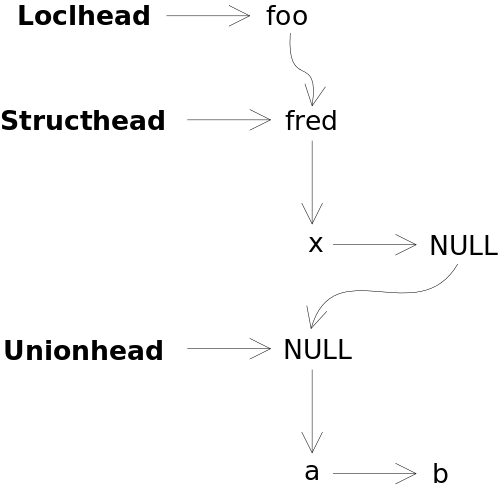

# Part 30: Designing Structs, Unions and Enums

I'm going to sketch out my design ideas for implementing structs, unions and
enums in ths part of our compiler writing journey. As with functions, it's
going to take a number of following steps to get it all implemented.

I've also chosen to rewrite the symbol table from being a single array to being
several singly-linked lists. I already mentioned my intention to do this: my
ideas on how to implement the composite types made it important to rewrite the
symbol table implementation at this point.

Before we get into the code changes, let's look at what, exactly, are composite
types.

## Composite Types, Enums and Typedefs

In C, [structs](https://en.wikipedia.org/wiki/Struct_(C_programming_language))
and [unions](https://en.wikipedia.org/wiki/Union_type#C/C++) are known
as *composite types*. A struct or union variable can have many members
contained within. The difference is that, in a struct, the members are
guaranteed not to overlap in memory whereas, in a union, we desire that
all the members share the same memory locations.

An example of a struct type is:

```c
struct foo {
  int  a;
  int  b;
  char c;
};

struct foo fred;
```

The variable `fred` is of type `struct foo`, and it has three members `a`, `b` and
`c`. We can now do these three assignments to `fred`:

```c
  fred.a= 4;
  fred.b= 7;
  fred.c= 'x';
```

and all three values are stored in the respective members in `fred`.

On the other hand, here is an example of a union type:

```c
union bar {
  int  a;
  int  b;
  char c;
};

union bar jane;
```

If we perform these statements:

```c
  jane.a= 5;
  printf("%d\n", jane.b);
```

then the value 5 will be printed as the `a` and `b` members occupy the same
memory location in the `jane` union.

### Enums

I'll talk about enums here even though they don't define a composite type like
the structs and unions.
In C, [enums](https://en.wikipedia.org/wiki/Enumerated_type#C) are essentially
a way to give names to integer values. An enum represents a list of
named integer values.

As an example, we can define these new identifiers:

```c
enum { apple=1, banana, carrot, pear=10, peach, mango, papaya };
```

We now have these named integer values:

|  Name  | Value |
|:------:|:-----:|
| apple  |   1   |
| banana |   2   |
| carrot |   3   |
| pear   |  10   |
| peach  |  11   |
| mango  |  12   |
| papaya |  13   |

There are some interesting issues with enums that I didn't know, which I'll cover below.

### Typedefs

I should also touch on typedefs at this point, even though I won't need to
implement them to get our compiler to compile itself. A 
[typedef](https://en.wikipedia.org/wiki/Typedef) is a way to give an existing
type another name. It's often used to make naming structs and unions easier.

Using a previous example, we can write:

```c
typedef struct foo Husk;
Husk kim;
```

`kim` is of type `Husk` which is the same as saying that `kim` is of type `struct foo`.

## Types versus Symbols?

So, if structs, unions and typedefs are new types, what have they got to do with
the symbol table which holds variable and function definitions? And enums are
just names for integer literals, again not variables or functions.

The thing is, all of these things have *names*: the name of the struct or union,
the name of their members, the types of the members, the names of the enumerated
values, and the names of the typedefs.

We need to store these names somewhere, and we need to be able to find them. For
the struct/union members, we need to find their underlying types. For the enumerated
names, we need to look up their integer literal values.

This is why I'm going to use the symbol table to store all of these things. But,
we need to break up the table into several specific lists, so that we can find
particular things and avoid finding things that we don't want to find.

## Redesigning the Symbol Table Structure

Let's have, to start with:

 + a singly-linked list for the global variables and functions
 + a singly-linked list for the variables local to the current function
 + a singly-linked list for the parameters local to the current function

With the old array-based symbol table, we had to skip over the function parameters
when we were searching for global variables and functions. So, let's also have a
list in a separate direction for the parameters of a function:

```c
struct symtable {
  char *name;                   // Name of a symbol
  int stype;                    // Structural type for the symbol
  ...
  struct symtable *next;        // Next symbol in one list
  struct symtable *member;      // First parameter of a function
};
```

Let's have a look, graphically, how this will
look for the following code fragment:

```c
  int a;
  char b;
  void func1(int x, int y);
  void main(int argc, char **argv) {
    int loc1;
    int loc2;
  }
```

This will be stored in three symbol table lists like this:


Note that we have three list "heads" which point to the three lists.
We can now walk the global symbol list and not have to skip over the
parameters, as each function keeps its parameters on its own list.

When it comes time to parse a function's body, we can point the parameter
list at the function's parameter list. Then, as local variables get declared,
they are simply appended to the local variable list.

Then, once the function's body is parsed and its assembly code generated,
we can set the parameter and local lists back to being empty without
disturbing the parameter list in the globally-visible function.
This is where I'm up to with the rewrite of the symbol table. But it doesn't
show how we can implement structs, unions and enums.

## Interesting Issues and Considerations

Before we do see how to augment the existing symbol table node, plus
singly-linked lists, to support structs, unions and enums, we first have
to consider some of their more interesting issues.

### Unions

We'll start with unions. Firstly, we can put a union into a struct.
Secondly, the union doesn't need a name. Thirdly, a variable does not
need to be declared in the struct to hold the union. As an example:

```c
#include <stdio.h>
struct fred {
  int x;
  union {
    int a;
    int b;
  };            // No need to declare a variable of this union type
};

int main() {
  struct fred foo;
  foo.x= 5;
  foo.a= 12;                            // a is treated like a struct member
  foo.b= 13;                            // b is treated like a struct member
  printf("%d %d\n", foo.x, foo.a);      // Print 5 and 13
}
```

We need to be able to support this. Anonymous unions (and structs) will
be easy: we just leave the `name` in the symbol table node set to NULL.
But there is no variable name for this union: I think we can implement this
by having the struct's member name also set to NULL, i.e.



### Enums

I've used enums before but I haven't really thought about implementing them
that much. So I wrote the following C program to see if I could "break" enums:

```c
#include <stdio.h>

enum fred { bill, mary, dennis };
int fred;
int mary;
enum fred { chocolate, spinach, glue };
enum amy { garbage, dennis, flute, amy };
enum fred x;
enum { pie, piano, axe, glyph } y;

int main() {
  x= bill;
  y= pie;
  y= bill;
  x= axe;
  x= y;
  printf("%d %d %ld\n", x, y, sizeof(x));
}
```

The questions are:

 + Can we redeclare an enum list with different elements, e.g. `enum fred` and
   `enum fred`?
 + Can we declare a variable with the same name as an enum list, e.g. `fred`?
 + Can we declare a variable with the same name as an enum value, e.g. `mary`?
 + Can we reuse the name of an enum value from one enum list in another, e.g.
   `dennis` and `dennis`?
 + Can we assign a value from one enum list to a variable declared to be
   of a different enum list?
 + Can we assign bewteen variables declared to be of different enum lists?

And here is what `gcc` produces as errors and warnings:

```c
z.c:4:5: error: ‘mary’ redeclared as different kind of symbol
 int mary;
     ^~~~
z.c:2:19: note: previous definition of ‘mary’ was here
 enum fred { bill, mary, dennis };
                   ^~~~
z.c:5:6: error: nested redefinition of ‘enum fred’
 enum fred { chocolate, spinach, glue };
      ^~~~
z.c:5:6: error: redeclaration of ‘enum fred’
z.c:2:6: note: originally defined here
 enum fred { bill, mary, dennis };
      ^~~~
z.c:6:21: error: redeclaration of enumerator ‘dennis’
 enum amy { garbage, dennis, flute, amy };
                     ^~~~~~
z.c:2:25: note: previous definition of ‘dennis’ was here
 enum fred { bill, mary, dennis };
                         ^~~~~~
```

After modifying and compiling the above program a few times, the answers are:

 + We can't redeclare `enum fred`. This seems to be the only place where
   we need to remember the name of an enum list.
 + We can reuse the enum list identifier `fred` as a variable name.
 + We can't reuse the enum value identifier `mary` in another enum list,
   nor as a variable name.
 + We can assign enum value anywhere: they seem to be treated simply as
   names for literal integer values.
 + It also appears that we can replace `enum` and `enum X` as a type
   with the word `int`.

## Design Considerations

OK, so I think we're at the point where we can start listing what we want:

 + a list of named and unnamed structs, with the names of the members in
   each struct and the type details for each member. Also, we will need
   the memory offset for the member from the "base" of the struct.
 + ditto for named and unnamed structs, although the offset will always be zero.
 + a list of enumerated list names and the actual enumeration names and their associated
   values.
 + in the symbol table, we need the existing `type` information for non-composite
   types, but we'll also need a pointer to the relevant composite type, if a
   symbol is a struct or a union.
 + given that a struct can have a member which is a pointer to itself, we will
   need to be able to point the member's type back to the same struct.

## Changes to the Symbol Table Node Structure

Below, in bold, are my changes to the current singly-linked list symbol table node:

<pre>
struct symtable {
  char *name;                   // Name of a symbol
  int type;                     // Primitive type for the symbol
  <b>struct symtable *ctype;       // If needed, pointer to the composite type</b>
  int stype;                    // Structural type for the symbol
  int class;                    // Storage class for the symbol
  union {
    int size;                   // Number of elements in the symbol
    int endlabel;               // For functions, the end label
    <b>int intvalue;               // For enum symbols, the associated value</b>
  };
  union {
    int nelems;                 // For functions, # of params
    int posn;                   // For locals, the negative offset
                                // from the stack base pointer
  };
  struct symtable *next;        // Next symbol in one list
  struct symtable *member;      // First member of a function, struct,
};                              // union or enum
</pre>

Along with this new node structure, we will have six linked lists:

 + a singly-linked list for the global variables and functions
 + a singly-linked list for the variables local to the current function
 + a singly-linked list for the parameters local to the current function
 + a singly-linked list for the struct types that have been defined
 + a singly-linked list for the union types that have been defined
 + a singly-linked list for the enum names and enumerated values that have been defined

## The Use Cases for the New Symbol Table Node

Let's look at how each field in the above struct will get used by the six lists
I enumerated above.

### New Types

We will have two new types, P_STRUCT and P_UNION, which I'll describe below.

### Global Variables and Functions, Parameter Variables, Local Variables

 + *name*: name of the variable or function.
 + *type*: type of the variable, or the function's return value, plus the 4-bit
   indirection level.
 + *ctype*: if the variable is a P_STRUCT or P_UNION, this field points at the
   associated struct or union definition in the relevant singly-linked list.
 + *stype*: structural type of the variable or function: S_VARIABLE, S_FUNCTION or
   S_ARRAY.
 + *class*: storage class for the variable: C_GLOBAL, C_LOCAL, or C_PARAM.
 + *size*: for variables, the total size in bytes. For arrays, the number of elements
   in the array. We will use this to implement `sizeof()` later.
 + *endlabel*: for functions, the end label which we can `return` to.
 + *nelems*: for functions, the number of parameters.
 + *posn*: for local variables and parameters, the negative offset of the variable
   from the stack base pointer.
 + *next*: the next symbol in this list.
 + *member*: for functions, a pointer to the first parameter's node. NULL for
    variables.

### Struct Types

 + *name*: name of the struct type, or NULL if it is anonymous.
 + *type*: always P_STRUCT, not really required.
 + *ctype*: unused.
 + *stype*: unused.
 + *class*: unused.
 + *size*: the total size of the struct in bytes, to be used by `sizeof()` later.
 + *nelems*: the number of members in the struct.
 + *next*: the next struct type that has been defined.
 + *member*: a pointer to the first struct member's node.

### Union Types

 + *name*: name of the union type, or NULL if it is anonymous.
 + *type*: always P_UNION, not really required.
 + *ctype*: unused.
 + *stype*: unused.
 + *class*: unused.
 + *size*: the total size of the union in bytes, to be used by `sizeof()` later.
 + *nelems*: the number of members in the union.
 + *next*: the next union type that has been defined.
 + *member*: a pointer to the first union member's node.

### Struct and Union Members

Each member is essentially a variable, so there is a strong similarity to normal
variables.
 
 + *name*: name of the member.
 + *type*: type of the variable plus the 4-bit indirection level.
 + *ctype*: if the member is a P_STRUCT or P_UNION, this field points at the
   associated struct or union definition in the relevant singly-linked list.
 + *stype*: structural type of the member: S_VARIABLE or S_ARRAY.
 + *class*: unused.
 + *size*: for variables, the total size in bytes. For arrays, the number of elements
   in the array. We will use this to implement `sizeof()` later.
 + *posn*: the positive offset of the member from the base of the struct/union.
 + *next*: the next member in the struct/union.
 + *member*: NULL.

### Enum List Names and Values

I want to store all the symbols and implicit values below:

```c
  enum fred { chocolate, spinach, glue };
  enum amy  { garbage, dennis, flute, couch };
```

We could just link `fred` then `amy`, and use the `member` field in `fred` for
the `chocolate`, `spinach`, `glue` list. Ditto the `garbage` etc. list.

However, we really only care about the `fred` and `amy` names to prevent them
being reused as enum list names. What we really care about are the actual
enumeration names and their values.

Therefore I propose a couple of "dummy" type values: P_ENUMLIST and P_ENUMVAL.
We then build just a single-dimensional list like this:

```c
     fred  -> chocolate-> spinach ->   glue  ->    amy  -> garbage -> dennis -> ...
  P_ENUMLIST  P_ENUMVAL  P_ENUMVAL  P_ENUMVAL  P_ENUMLIST  P_ENUMVAL  P_ENUMVAL
```

Thus, when we use the word `glue`, we only have to walk the one list. Otherwise,
we'd have to find `fred`, walk `fred`'s member list, then the same for `amy`.
I think the one list will be easier.

## What Has Been Changed Already

Up at the top of this document, I mentioned that I've already
rewritten the symbol table from being a single array to being
several singly-linked lists, with these new fields in the `struct symtable` node:

```c
  struct symtable *next;        // Next symbol in one list
  struct symtable *member;      // First parameter of a function
```

So, let's have a quick tour of the changes. Firstly, there are no functional
changes whatsoever.

### Three Symbol Table Lists

We now have three symbol table lists in `data.h`:

```c
// Symbol table lists
struct symtable *Globhead, *Globtail;   // Global variables and functions
struct symtable *Loclhead, *Locltail;   // Local variables
struct symtable *Parmhead, *Parmtail;   // Local parameters
```

and all of the functions in `sym.c` have been rewritten to use them. I have written
a generic function to append to a list:

```c
// Append a node to the singly-linked list pointed to by head or tail
void appendsym(struct symtable **head, struct symtable **tail,
               struct symtable *node) {

  // Check for valid pointers
  if (head == NULL || tail == NULL || node == NULL)
    fatal("Either head, tail or node is NULL in appendsym");

  // Append to the list
  if (*tail) {
    (*tail)->next = node; *tail = node;
  } else *head = *tail = node;
  node->next = NULL;
}
```

There is now a function `newsym()` which is given all the field values of a
symbol table node. It `malloc()`s a new node, fills it in and returns it. I
won't give the code here.

For each list, there is a function to build and append a node to the list. One
example is:

```c
// Add a symbol to the global symbol list
struct symtable *addglob(char *name, int type, int stype, int class, int size) {
  struct symtable *sym = newsym(name, type, stype, class, size, 0);
  appendsym(&Globhead, &Globtail, sym);
  return (sym);
}
```

There is a generic function to find a symbol in a list, where the `list` pointer
is the head of the list:

```c
// Search for a symbol in a specific list.
// Return a pointer to the found node or NULL if not found.
static struct symtable *findsyminlist(char *s, struct symtable *list) {
  for (; list != NULL; list = list->next)
    if ((list->name != NULL) && !strcmp(s, list->name))
      return (list);
  return (NULL);
}
```

and there are three list-specific `findXXX()` functions.

There is a function, `findsymbol()`, that tries to find a symbol in a function's
parameter list first, then the function's local variables, then finally global
variables.

There is a function, `findlocl()`, that only searches a function's parameter
list and local variables. We use this one when we are declaring local variables
and need to prevent a redeclaration.

Finally, there is a function, `clear_symtable()`, to reset the head and tail of
all three lists to NULL, i.e. to clear all three lists.

### The Parameter and Local Lists

The global symbol lists is only cleared once each individual source code file is
parsed. But we need to a) set up the parameter list, and b) clear the local symbol
list, each time we start parsing the body of a new function.

So here is how it works. When we are parsing a parameter list in `param_declaration()`
in `expr.c`, we call `var_declaration()` for each parameter. This creates a symbol
table node and appends it to the parameter list, i.e. `Parmhead` and `Parmtail`.
When `param_declaration()` returns, `Parmhead` points at the parameter list.

Back in `function_declaration()` which is parsing the whole function (its name,
parameter list *and* any function body), the parameter list is copied into the
function's symbol table node:

```c
    newfuncsym->nelems = paramcnt;
    newfuncsym->member = Parmhead;

    // Clear out the parameter list
    Parmhead = Parmtail = NULL;
```

We clear the parameter list by `NULL`ing `Parmhead` and `Parmtail`, as shown.
This would mean that all these are no longer available to search for via the global parameter list.

The solution is to set a global variable, `Functionid`, to the function's
symbol table entry:

```c
  Functionid = newfuncsym;
```

So, when we call `compound_statement()` to parse the function's body,
we still have the parameter list available through `Functionid->member` to
do things like:

 + prevent a local variable being declared that matches a parameter name
 + use a parameter's name as a normal local variable etc.

Eventually, `function_declaration()` returns the AST tree which covers the
whole function back to `global_declarations()` which then passes it to
`genAST()` in `gen.c` to generate the assembly code. And when `genAST()` returns,
`global_declarations()` calls `freeloclsyms()` to clear the local and parameter
lists and reset `Functionid` back to `NULL`.

### Other Changes of Note

Well, actually a heck of a lot of code had to be rewritten due to the
change to several linked lists for the symbol table. I'm not going to
go through the whole code base. But some things you can spot easily.
For example, symbol nodes used to be referenced with code like `Symtable[n->id]`.
This is now `n->sym`.

Also, a lot of the code in `cg.c` refers to symbol names, so you now see these as
`n->sym->name`. Similarly, the code to dump the AST trees in `tree.c` now
has a lot of `n->sym->name` in it.

## Conclusion and What's Next

This part of our journey was part design and part reimplementation. We spent
a lot of time working out what issue we will face when implementing structs,
unions and enums. Then we redesigned the symbol table to support these
new concepts. Finally, we rewrote  the symbol table into three linked lists
(for now) in preparation for the implementation of these new concepts.

In the next part of our compiler writing journey, I'll probably implement
the declaration of struct types, but not actually write the code for them to
be used. I'll do that in the following part. With both of these done, I'll
hopefully be able to implement unions in a third part. Then, enums in the
fourth part. We'll see! [Next step](../31_Struct_Declarations/Readme.md)
