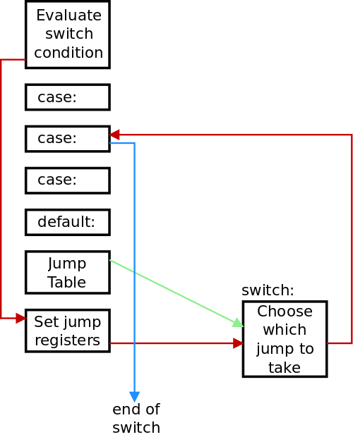
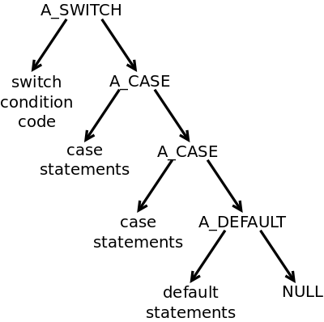
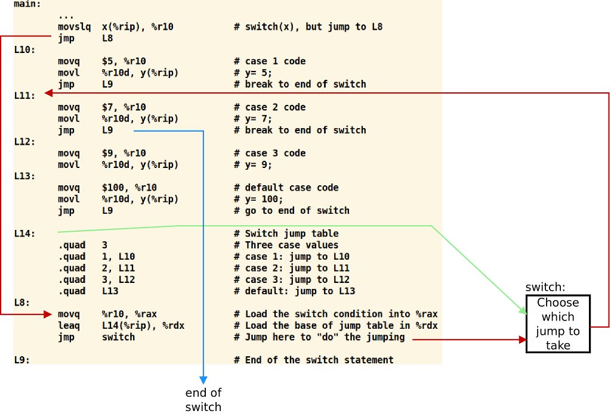

# Part 37: Switch Statements

In this part of our compiler writing journey, we are going to implement
the 'switch' statement. This is really tricky for several reasons which
I'll cover. So let's start with an example and look at the implications.

## An Example Switch Statement

```c
  switch(x) {
    case 1:  printf("One\n");  break;
    case 2:  printf("Two\n");  break;
    case 3:  printf("Three\n");
    default: printf("More than two\n");
  }
```

This is like a multi-way 'if' statement where the value of `x` chooses
the branch to take. However, we need to insert the `break` statement to
bypass all the other branches; if we leave out the `break` statement,
the branch that we are in falls through and continues on with the execution
of the next branch.

The expression for the 'switch' decision has to be integer, and all of the
case options have to be integer literals. We can't say `case 3*y+17`, for
example.

The `default` case catches all values that are not given by previous cases.
It has to appear as the last case in the list. Also, we cannot have duplicate
case values, so `case 2: ...; case 2` is not permitted.

## Converting the Above into Assembly

One way to translate a 'switch' statement into assembly is to treat it
as a multi-way 'if' statement. This would mean that we would compare
`x` against integer values, one after the other, and go into or skip
over sections of assembly code as required. This would work but it makes
the assembly code inefficient, especially if you consider this example:

```c
  switch (2 * x - (18 +y)/z) { ... }
```

Given our current
"[KISS](https://en.wikipedia.org/wiki/KISS_principle)"
compiler's operation, we would have to evaluate the
expression again and again for each comparison against a literal value.

It makes more sense to evaluate the 'switch' expression once. Then, compare
this value against a table of case literal values. When we find a match, we
jump to the code branch associated with the case values. This is known
as a [jump table](https://en.wikipedia.org/wiki/Branch_table).

It means that, for each case option, we will need to create a label to place
at the beginning of the code for this option. As an example, the jump table
for the first example above might look like:

| Case Value | Label |
|:----------:|:-----:|
|     1      |  L18  |
|     2      |  L19  |
|     3      |  L22  |
|  default   |  L26  |

We also need a label to mark the code after the 'switch' statement. When
one code branch wants to `break;`, we jump to this 'switch' end label.
Otherwise, we let the code branch fall through into the next code branch.

## Parsing Implications

All of the above is fine and good, except that we have to parse a 'switch'
statement from top to bottom. This means that we won't know how big the
jump table should be until after we have parsed all of the cases. This
also means that, unless we perform some clever tricks, we will have generated
the assembly code for all the cases *before* we can generate the jump table.

As you know, I'm writing this compiler following the "KISS principle": keep
it simple, stupid! So I am avoiding the clever tricks, but this means that,
yes, we are going to delay the output of the jump table until after we
generate all of the assembly code for the various cases.

Visually, here is how we are going to lay out our code:



The code to evaluate the switch decision is at the top, as we parse it first.
We don't want to continue on into the first case, so we can jump to a label
which we will output later.

Then we parse each case statement and generate the corresponding assembly code.
We will have already generated an "end of switch" label, so we can jump to it.
Again, we will output this label later.

As we generate each case, we get a label for it and output this label. 
Once all the cases and the default case (if any) are output, we can now
generate the jump table.

But now we need some code to walk the jump table, compare the switch
decision against each case value, and jump appropriately. We could
generate this assembly code for each and every 'switch' statement but,
if this jump handling code is large, we will be wasting memory. It's
better to have one copy of the jump handling code in memory, but now
we have to jump to it! Even worse, this code doesn't know which register
holds the switch decision result, so we will have to copy this register
into a known register, and copy the base of the jump table into a known
register.

What we have done here is trade off complexity in the parsing and code
generation for a spaghetti of assembly code with jumps all over the place.
Well, the CPU can deal with the jump spaghetti, so for now it's a fair
tradeoff. Obviously, a production compiler would do things differently.

The red lines in the diagram show the flow of execution from the
switch decision to loading the registers to the jump table handling
and finally to the specific case code. The green line shows that the
base address of the jump table is passed to the jump table handling code.
Finally, the blue lines shows that the case ended with a `break;` which
jumped to the end of the switch assembly code.

So, the assembly output is ugly but it does work. Now that we've seen
how we are going to implement 'switch' statements, let's actually do it.

## New Keywords and Tokens

We have two new tokens, T_CASE and T_DEFAULT, to go along with the new `case`
and `default` keywords. As always, browse the code to see how this is done.

## New AST Node Types

We need to build the AST tree to represent 'switch' statements. The structure
of a 'switch' statement is in no way a binary tree like our expressions.
But it is *our* AST tree, so we can shape it any way that suits us.
So I sat down for a bit and decided to go with this structure:



The root of the 'switch' tree is A_SWITCH, On the left is the sub-tree with
the expression that calculates the switch's condition. On the right we
have a linked list of A_CASE nodes, one for each case. Finally, there is
an optional A_DEFAULT to capture any default case.

The `intvalue` field in each A_CASE node will hold the case value which
the expression must match. The left child sub-tree will hold the details
of the compound statement which is the case's body. At this point, we don't
have any jump labels or the jump table: we will generate this later.

## Parsing the Switch Statement

With all the above on-board, we're now ready to look at the parsing of
a 'switch' statement. There is quite a lot of error checking code here,
so I will take it in small sections. This code is in `stmt.c` and
is called from `single_statement()`:

```c
    case T_SWITCH:
      return (switch_statement());
```

Let's go..

```c
// Parse a switch statement and return its AST
static struct ASTnode *switch_statement(void) {
  struct ASTnode *left, *n, *c, *casetree= NULL, *casetail;
  int inloop=1, casecount=0;
  int seendefault=0;
  int ASTop, casevalue;

  // Skip the 'switch' and '('
  scan(&Token);
  lparen();

  // Get the switch expression, the ')' and the '{'
  left= binexpr(0);
  rparen();
  lbrace();

  // Ensure that this is of int type
  if (!inttype(left->type))
    fatal("Switch expression is not of integer type");
```

OK, so there's a lot of local variables at the top which should clue you
in that we will have to deal with some state in this function. This first
section is easy, though: parse the `switch (expression) {` syntax, 
get the AST for the expression and ensure that its is of integer type.

```c
  // Build an A_SWITCH subtree with the expression as
  // the child
  n= mkastunary(A_SWITCH, 0, left, NULL, 0);

  // Now parse the cases
  Switchlevel++;
```

We've got the switch decision tree, so we can now build the A_SWITCH node
which we will return. Do you remember that we could only let a `break;`
occur when we are inside at least one loop. Well, now we also have to
let `break;` happen when there is at least one 'switch' statement. Thus,
there is a new global variable, `Switchlevel` to record this.

```c
  // Now parse the cases
  Switchlevel++;
  while (inloop) {
    switch(Token.token) {
      // Leave the loop when we hit a '}'
      case T_RBRACE: if (casecount==0)
                        fatal("No cases in switch");
                     inloop=0; break;
  ...
  }
```

The loop is controlled by `inloop` which starts at one. When we hit a '}'
token, we reset it to zero and break out of this 'switch' statement, thus
ending the loop. We also check that we have seen at least one case.

> It's a bit weird using a 'switch' statement to parse 'switch' statements.

Now we move on to the parsing of `case` and `default`:

```c
      case T_CASE:
      case T_DEFAULT:
        // Ensure this isn't after a previous 'default'
        if (seendefault)
          fatal("case or default after existing default");
```

We have a lot of common code to perform, so both tokens fall into the
same code. First, ensure that we haven't already seen a default case,
and this has to be the last case in the series.

```c
        // Set the AST operation. Scan the case value if required
        if (Token.token==T_DEFAULT) {
          ASTop= A_DEFAULT; seendefault= 1; scan(&Token);
        } else ...
```

If we are parsing `default:`, then there is no following integer value.
Skip over the keyword and record that we have seen a default case.

```c
        } else  {
          ASTop= A_CASE; scan(&Token);
          left= binexpr(0);
          // Ensure the case value is an integer literal
          if (left->op != A_INTLIT)
            fatal("Expecting integer literal for case value");
          casevalue= left->intvalue;

          // Walk the list of existing case values to ensure
          // that there isn't a duplicate case value
          for (c= casetree; c != NULL; c= c -> right)
            if (casevalue == c->intvalue)
              fatal("Duplicate case value");
        }
```

This code deals specifically with `case <value>:`. We read in the value after
the case using `binexpr()`. Now, I could have been "clever" and called
`primary()` instead  which goes straight to parsing integer literals.
However, `primary()` can call `binexpr()` anyway, so it really doesn't make
any difference: we are still going to have to error check the resulting
tree to ensure that it is an A_INTLIT node only.

Then we walk the list of previous A_CASE nodes that we have (`casetree`
points to the head of this list) to ensure that we don't have any
duplicate case values.

Along the way, we have set the `ASTop` variable to either A_CASE for
a case with an integer literal value or A_DEFAULT for the default case.
We can now perform the code common to both.

```c
        // Scan the ':' and get the compound expression
        match(T_COLON, ":");
        left= compound_statement(); casecount++;

        // Build a sub-tree with the compound statement as the left child
        // and link it in to the growing A_CASE tree
        if (casetree==NULL) {
          casetree= casetail= mkastunary(ASTop, 0, left, NULL, casevalue);
        } else {
          casetail->right= mkastunary(ASTop, 0, left, NULL, casevalue);
          casetail= casetail->right;
        }
        break;
```

Check that the next token is a ':'. Get the AST sub-tree with the
compound statement in it. Build an A_CASE or A_DEFAULT node with
this sub-tree as the left child, and link this to the linked list
of A_CASE/A_DEFAULT nodes: `casetree` is the head and `casetail`
is the tail of this list.

```c
      default:
        fatald("Unexpected token in switch", Token.token);
    }
  }
```

There should only be `case` and `default` keywords in the 'switch' body,
so ensure that this is the case.

```c
  Switchlevel--;

  // We have a sub-tree with the cases and any default. Put the
  // case count into the A_SWITCH node and attach the case tree.
  n->intvalue= casecount;
  n->right= casetree;
  rbrace();

  return(n);
```

We've finally parsed all of the cases and the default case, and we now
have the count of them and the list which `casetree` points to. Add
these values to the A_SWITCH node and return this as the final tree.

OK, so that was a substantial amount of parsing. Now we need to
turn our attention to code generation.

## Switch Code Generation: An Example.

At this point I think it would be worth seeing the assembly output of
an example 'switch' statement so that you can see how the code matches
the graphic of execution flow that I gave at the top. Here is the example:

```c
#include <stdio.h>

int x; int y;

int main() {
  switch(x) {
    case 1:  { y= 5; break; }
    case 2:  { y= 7; break; }
    case 3:  { y= 9; }
    default: { y= 100; }
  }
  return(0);
}
```

First up, yes we do need '{' ... '}' around the case bodies. This is
because I still haven't solved the "dangling else" problem, so all
compound statements have to be surrounded by '{' ... '}'.

I'm going to leave out the jump table handling code for now, but here is
the assembly output for this example:



The code that loads `x` into a register is at the top, and it
jumps down past the jump table. As the jump table handling code
doesn't know which register this will be, we always load the
value into `%rax`, and we load the jump table's base address
into `%rdx`.

The jump table itself has this structure:

 + First is the number of cases with integer values
 + Next is a set of value/label pairs, one for each case
 + Finally there is the label of the default case. If there is
   no default case, this has to be the label of the 'switch' end,
   so that we do no code if there is no matching case.

The jump table handling code (which we will look at soon)
interprets the jump table and jumps to one of the labels in this
table. Let's assume that we have jumped to `L11` which is 
`case 2:`. We perform the code for this case option. This option
has  a `break;` statement, so there is a jump to `L9` which is
the label for the end of the 'switch' statement.

## The Jump Table Handling Code

You already know that x86-64 assembly code isn't my forte.
Therefore, I've borrowed the jump table handling code directly
from [SubC](http://www.t3x.org/subc/). I've added it to
the `cgpreamble()` function in `cg.c`, so that it is output
for every assembly file that we create. Here is the commented code:

```
# internal switch(expr) routine
# %rsi = switch table, %rax = expr

switch:
        pushq   %rsi            # Save %rsi
        movq    %rdx,%rsi       # Base of jump table -> %rsi
        movq    %rax,%rbx       # Switch value -> %rbx
        cld                     # Clear direction flag
        lodsq                   # Load count of cases into %rcx,
        movq    %rax,%rcx       # incrementing %rsi in the process
next:
        lodsq                   # Get the case value into %rdx
        movq    %rax,%rdx
        lodsq                   # and the label address into %rax
        cmpq    %rdx,%rbx       # Does switch value matches the case?
        jnz     no              # No, jump over this code
        popq    %rsi            # Restore %rsi
        jmp     *%rax           # and jump to the chosen case
no:
        loop    next            # Loop for the number of cases
        lodsq                   # Out of loop, load default label address
        popq    %rsi            # Restore %rsi
        jmp     *%rax           # and jump to the default case
```

We need to thanks Nils Holm for writing this, as I would never have arrived
at this code!

Now we can look at how the above assembly code
gets generated. Fortunately, we already have lots
of useful functions in `cg.c` which we can reuse.

## Generating the Assembly Code

In `genAST()` in `gen.c`, up near the top we identify an A_SWITCH
node and call a function to deal with this node and the tree below it.

```c
    case A_SWITCH:
      return (genSWITCH(n));
```

So let's look at this new function in stages:

```c
// Generate the code for a SWITCH statement
static int genSWITCH(struct ASTnode *n) {
  int *caseval, *caselabel;
  int Ljumptop, Lend;
  int i, reg, defaultlabel = 0, casecount = 0;
  struct ASTnode *c;

  // Create arrays for the case values and associated labels.
  // Ensure that we have at least one position in each array.
  caseval = (int *) malloc((n->intvalue + 1) * sizeof(int));
  caselabel = (int *) malloc((n->intvalue + 1) * sizeof(int));
```

The reason for the `+1` here is that we may have a default
case which needs a label even though it doesn't have a
case value.

```c
  // Generate labels for the top of the jump table, and the
  // end of the switch statement. Set a default label for
  // the end of the switch, in case we don't have a default.
  Ljumptop = genlabel();
  Lend = genlabel();
  defaultlabel = Lend;
```

These labels are made but not output as assembly yet.
Until we have a default label, we set it to `Lend`.

```c
  // Output the code to calculate the switch condition
  reg = genAST(n->left, NOLABEL, NOLABEL, NOLABEL, 0);
  cgjump(Ljumptop);
  genfreeregs();
```

We output the code to jump to the code after the
jump table even though it hasn't been output. We can
also free all the registers at this point.

```c
  // Walk the right-child linked list to
  // generate the code for each case
  for (i = 0, c = n->right; c != NULL; i++, c = c->right) {

    // Get a label for this case. Store it
    // and the case value in the arrays.
    // Record if it is the default case.
    caselabel[i] = genlabel();
    caseval[i] = c->intvalue;
    cglabel(caselabel[i]);
    if (c->op == A_DEFAULT)
      defaultlabel = caselabel[i];
    else
      casecount++;

    // Generate the case code. Pass in the end label for the breaks
    genAST(c->left, NOLABEL, NOLABEL, Lend, 0);
    genfreeregs();
  }
```

This is the code that both generates the label for each case
and also outputs the assembly code which is the body of the
case. We store the case value and the case label in the two
arrays. And, if this is the default case, we can update
`defaultlabel` with the correct label.

Also note that `genAST()` gets passed `Lend` which is the
label after our 'switch' code. This allows any `break;`
in the case body to jump out to what comes next.

```c
  // Ensure the last case jumps past the switch table
  cgjump(Lend);

  // Now output the switch table and the end label.
  cgswitch(reg, casecount, Ljumptop, caselabel, caseval, defaultlabel);
  cglabel(Lend);
  return (NOREG);
}
```

We can't rely on the programmer to end their last case
with a `break;'` statement, so we force the last case to
have a jump to the end of the switch statement.

At this point we have:

 + the register which has the switch value
 + the array of case values
 + the array of case labels
 + the number of cases
 + some useful labels

We pass all of these into `cgswitch()` in `cg.c`,
and (apart from the code from SubC) this is the only new
assembly code we need to introduce for this part.

## `cgswitch()`

Here, we need to build the jump table and
load the registers so that we can jump to
the `switch` assembly code. As a reminder,
here is the jump table structure:

 + First is the number of cases with integer values
 + Next is a set of value/label pairs, one for each case
 + Finally there is the label of the default case. If there is
   no default case, this has to be the label of the 'switch' end,
   so that we do no code if there is no matching case.

For our example, the jump table looks like:

```
L14:                                    # Switch jump table
        .quad   3                       # Three case values
        .quad   1, L10                  # case 1: jump to L10
        .quad   2, L11                  # case 2: jump to L11
        .quad   3, L12                  # case 3: jump to L12
        .quad   L13                     # default: jump to L13
```

Here is how we generate all of this.


```c
// Generate a switch jump table and the code to
// load the registers and call the switch() code
void cgswitch(int reg, int casecount, int toplabel,
              int *caselabel, int *caseval, int defaultlabel) {
  int i, label;

  // Get a label for the switch table
  label = genlabel();
  cglabel(label);
```

This is the `L14:` above.

```c
  // Heuristic. If we have no cases, create one case
  // which points to the default case
  if (casecount == 0) {
    caseval[0] = 0;
    caselabel[0] = defaultlabel;
    casecount = 1;
  }
```

We must have at least one case value/label
pair in the jump table. This code makes one
that points at the default case. The case
value is irrelevant: if it matches, fine. If
not, we jump to the default case anyway.

```c
  // Generate the switch jump table.
  fprintf(Outfile, "\t.quad\t%d\n", casecount);
  for (i = 0; i < casecount; i++)
    fprintf(Outfile, "\t.quad\t%d, L%d\n", caseval[i], caselabel[i]);
  fprintf(Outfile, "\t.quad\tL%d\n", defaultlabel);
```

Here is the code to generate the jump table. Nice and easy.

```c
  // Load the specific registers
  cglabel(toplabel);
  fprintf(Outfile, "\tmovq\t%s, %%rax\n", reglist[reg]);
  fprintf(Outfile, "\tleaq\tL%d(%%rip), %%rdx\n", label);
  fprintf(Outfile, "\tjmp\tswitch\n");
}
```

Finally, load the `%rax` register with the switch
value, load `%rdx` with the label of the jump table
and call the `switch` code.

## Testing The Code

I've augmented our example with a loop so that all
cases in the 'switch' statement get tested This is
the file `tests/input74.c`:

```c
#include <stdio.h>

int main() {
  int x;
  int y;
  y= 0;

  for (x=0; x < 5; x++) {
    switch(x) {
      case 1:  { y= 5; break; }
      case 2:  { y= 7; break; }
      case 3:  { y= 9; }
      default: { y= 100; }
    }
    printf("%d\n", y);
  }
  return(0);
}
```

And here is the output from the program:

```
100
5
7
100
100
```

Note that the value 9 is not output, because we
fall into the default case when we are doing case 3.

## Conclusion and What's Next

We've just implemented our first really big new statement in
our compiler, the 'switch' statement. As I've never done this
before, I essentially followed the SubC implementation. There
are many other, more efficient, ways to implement 'switch',
but I applied the "KISS principle" here. That said, it still
was quite a complicated implementation.

If you are still reading at this point, congratulations on
your staying power!

I'm starting to get annoyed with the compulsory '{' ... '}'
around all of our compound statements.
So, in the next part of our compiler writing journey, 
I will bite the bullet and attempt to solve the "dangling else"
problem. [Next step](../38_Dangling_Else/Readme.md)
