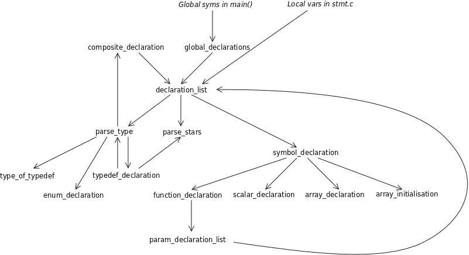

# Part 39: Variable Initialisation, part 1

We can declare variables in the language that our compiler accepts, but
we can't initialise them at the same time. So in this part (and the following parts)
I will work on fixing this.

It's worth thinking about this now before we do any actual implementation
because, hopefully, I can devise a way to share some of the code. So
I might do a bit of a "brain dump" below to help me think about the problem.

Right now, we can declare variables in three places:

  + Global variables are declared outside of any function
  + Function parameters are declared in a parameter list
  + Local variables are declared inside of a function

Each declaration includes a description of the variable's type and its name.

In terms of initialisation:

  + We can't initialise function parameters, as they will get
    values copied in from the function caller's arguments.
  + Global variables cannot be initialised with an expression,
    as there is no function in which the expression assembly code
    can run.
  + Local variables can be initialised with an expression.

We also want to have a list of variable names after the type definition.
This means that there will some similarities and some differences to
deal with. In semi-BNF syntax:

```
global_declaration: type_definition global_var_list ';' ;

global_var_list: global_var
               | global_var ',' global_var_list  ;

global_var: variable_name
          | variable_name '=' literal_value ;

local_declaration: type_definition local_var_list ';' ;

local_var_list: local_var
              | local_var ',' local_var_list  ;

local_var: variable_name
         | variable_name '=' expression ;

parameter_list: parameter
              | parameter ',' parameter_list ;

parameter: type_definition variable_name ;
```
Here is a set of examples that I do want to
support in our compiler.

### Global Declarations

```c
  int   x= 5;
  int   a, b= 7, c, d= 6;
  char *e, f;                           // e is a pointer, f isn't!
  char  g[]= "Hello", *h= "foo";
  int   j[]= { 1, 2, 3, 4, 5 };
  char *k[]= { "fish", "cat", "ball" };
  int   l[70];
```

The comment I added has deep implications. We will have to parse the
type at the front and, for *each* following variable, parse any prefix
'*' or postfix '[ ]' to decide if it's a pointer or an array.

I will only deal with a single dimensional list of initialisation values
as shown in the examples above.

### Local Declarations

The above examples also apply, but we should also be able to do these local declarations:

```c
  int u= x + 3;
  char *v= k[0];
  char *w= k[b-6];
  int y= 2*b+c, z= l[d] + j[2*x+5];
```

I was going to offer to parse
`int list[]= { x+2, a+b, c*d, u+j[3], j[x] + j[a] };`
but that looks like an absolute nightmare to deal with, so I think I will
stick with either a list of literal values, or not even allow array
initialisation in local scope.

## Now What?

Right now, after looking at the above examples, I'm kind of terrified!
I think I can do the global variable initialisation, but I'll have to
rewrite how I parse the types of each individual variable in a list.
Then I can parse the '='.

If we are in global scope, I'll call a function to parse the literal values.

If in local scope, I can't use the existing `binexpr()` function because
it parses the variable name on the left and makes an lvalue AST node for it
internally. Perhaps I can hand-build this lvalue AST node and pass the
pointer to it into `binexpr()`. Then I can add code to `binexpr()` that says:

```
  if we got an lvalue pointer {
    set left to this pointer
  } else {
    left = prefix();
    deal with the operator token
  }
  rest of the existing code
```

Ok, so I have a sort-of plan. I'll do some refactoring first.
And the first task is to work out how to rewrite the parsing of
types and variable names so that we can parse lists of them.

## A Look at the Refactoring

So I've just done the refactoring of the code and it feels like I've just
rearranged code but that's not entirely true. So what I'll do is show you
how all the new functions call each other, and then outline what each one does.

I've drawn a call graph of the code in the new `decl.c`:



At the top, `global_declarations()` is called to parse anything which is
global. It simply loops and calls `declaration list()`. Alternatively,
we are in a function and we've hit a type token (`int`, `char` etc.). We
call `declaration_list()` to parse what should be a variable.

`declaration_list()` is new. It calls `parse_type()` to get the type
(e.g. `int`, `char`, a struct, union or typedef etc.). This is the
*base type* of a list, but each thing in the list can modify this type.
As an example:

```c
  int a, *b, c[40], *d[100];
```

So in `declaration_list()` we loop for each declaration in the list.
For each declaration, we call `parse_stars()` to see how the
base type is modified. At this point we can parse the identifier of
the individual declaration, and this is done in `symbol_declaration()`.
Based on what token follows, we call:

  + `function_declaration()` for functions,
  + `array_declaration` for arrays, or
  + `scalar_delaration` for scalar variables

In a function declaration, there can be parameters, so
`parameter_declaration_list()` is invoked to do this. Of course, the parameter
list is a declaration, so we call `declaration_list()` to deal with this!

Over on the left we have `parse_type()`. This gets ordinary types like
`int` and `char`, but this is where new types such as structs, unions,
enums and typedefs are also parsed.

Parsing a typedef in `typedef_declaration()` should be easy because there
is an existing type which we are aliasing. However, we can also write this:

```c
typedef char * charptr;
```

Because `parse_type()` doesn't deal with any `*` tokens,
`typedef_declaration()` has to manually call `parse_stars()` to see how the
base type is modified before creating the alias.

Any enum declaration is handled by `enum_declaration`. For structs and
unions, we call `composite_declaration()`. And guess what?! The members
inside a new struct or union form a list of member declarations, so we
call `declaration_list()` to parse them!

## Regression Testing

I'm so glad that I now have about eighty individual tests, because there
is no way I could safely refactor `decl.c` without being able to confirm
that the new code still produces the same errors or assembly output as
before.

## New Functionality

Although this part of the journey is mostly a redesign to get ready for
variable initialisation, we now support lists in global and local variable
declarations. Therefore, I have new tests:

```c
// tests/input84.c, locals
int main() {
  int x, y;
  x=2; y=3;
  ..
}

//input88.c, globals
struct foo {
  int x;
  int y;
} fred, mary;
```

## Conclusion and What's Next

I feel a bit happier now that I've got the compiler to parse a list
of variables following a type, e.g. `int a, *b, **c;`. I've also
put comments into the code where I will have to write the assignment
functionality to go with declarations.

In the next part of our compiler writing journey, we will try to add
global variable declarations with assignments to our compiler. [Next step](../40_Var_Initialisation_pt2/Readme.md)
