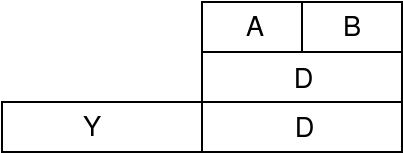

# Part 64: Self-compilation on an 8-bit CPU

I'm back with another chapter of this compiler writing journey. This time,
the goal is get the compiler to compile itself on a 8-bit CPU from the 1980s.
It's been an interesting, sometimes fun, sometimes painful task. Here's a
summary of all the work that I've had to do.

For the CPU, I chose the
[Motorola 6809](https://en.wikipedia.org/wiki/Motorola_6809). This is
probably one of the most sophisticated 8-bit CPUs from the 1980s, with
a bunch of useful addressing modes and, importantly, a useful stack pointer.

What makes it difficult to write a compiler for the 6809 is the address space
limitation. Like many of the 8-bit CPUs, there only 64K of memory
(yes, 65,536 _bytes_!) and, on most vintage 6809 systems, a significant
portion of this is taken up by ROM.

I went in this direction as, in 2023, I decided to try and build a
single board computer (SBC) using the 6809 as the CPU. In particular,
I wanted to have a machine with at least half a megabyte of memory,
a disk-like storage device, and a Unix-like operating system.

The result is the [MMU09 SBC](https://github.com/DoctorWkt/MMU09).
The project is semi-incomplete; it does have a Unix-like system,
it does do multitasking, but there is no pre-emptive multitasking.
Each process gets 63.5K of usable address space (i.e. RAM).

While I was working on MMU09, I needed to find a suitable C compiler to
compile the code for the operating system, the libraries and the applications.
I started with [CMOC](http://perso.b2b2c.ca/~sarrazip/dev/cmoc.html) but
eventually switched over to [vbcc](http://www.compilers.de/vbcc.html).
Along the way I found Alan Cox's
[Fuzix Compiler Kit](https://github.com/EtchedPixels/Fuzix-Compiler-Kit)
which is a work-in-progress C compiler for many 8-bit and 16-bit CPUs.

All of this got me to thinking: is it possible to have the C compiler
run _on_ the 6809 and not just cross compile from a more powerful system?
I thought the Fuzix Compiler Kit might be a contender but, no, it's just
too big to fit on the 6809 itself.

So here we are with the question/goal: can the "acwj" compiler be modified
to fit and run on a 6809 platform?

## The 6809 CPU

Let's start with a look at the 6809 CPU from a compiler writer's perspective.
I've already mentioned the 64K address space limitation: that's going to
require the "acwj" compiler to be completely restructured to fit. Now let's
look at the 6809's architecture.

<center>


Creative Commons CC0 license,
[Wikipedia](https://commons.wikimedia.org/wiki/File:6809_Internal_Registers.svg)
</center>

For an 8-bit CPU, the 6809 has quite a few registers. Well, it's not like
the x64 or a RISC CPU with a bunch of general-purpose registers. There is
a single 16-bit `D` register on which we can do logical and arithmetic
operations. It can also be accessed as two 8-bit registers `A` and `B`, of
which `B` is the least-significant byte in the `D` register.

When doing logical and arithmetic operations, the second operand is
either a memory location accessed via some addressing mode, or a literal value.
The result of the operation is put back in the `D` register: hence, it
_accumulates_ the operation's result.

To access memory, there are a bunch of addressing mode to do so. In fact,
there are many more available than a compiler needs! We have the index
registers `X` and `Y` to, for example, access an element in an array
when we know the base address and `X` holds the element's index.
We can also access memory by using a signed constant and the stack pointer
`S` as the index; this allows us to treat `S` as a 
[frame pointer](https://en.wikipedia.org/wiki/Call_stack#FRAME-POINTER).
We can find the local variables of a function at addresses below the
frame pointer and function arguments at addresses above the frame pointer.

Let's have a look at some examples to make the above a bit clearer:

```
    ldd #2         # Load D with the constant 2
    ldd 2          # Load D from addresses 2 and 3 (16 bits)
    ldd _x         # Load D from the location known as _x
    ldd 2,s        # Load D from an argument on the stack
    std -20,s      # Store D to a local variable on the stack
    leax 8,s       # Get the (effective) address which is S+8
                   # and store it in the X register
    ldd 4,x        # Now use that as a pointer to an int array
                   # and load the value at index 2 - remember
                   # that D is 16-bits (2 bytes), so 4 bytes
                   # are two 16-bit "words"
    addd -6,s      # Add the int we just fetched to a local
                   # variable and save it in the D register
```

For more details, I'd recommend that you browse through the
[6809 datasheet](docs/6809Data.pdf).
Pages 5-6 cover the registers, pages 16-18 cover the addressing modes,
and pages 25-27 list the available instructions.

Back to targetting the "acwj" compiler to the 6809. Well, having a lot
of addressing modes is great. We can deal with 8-bit values and 16-bit
values, but there are no 32-bit registers. OK, we can sort that out
somehow.

But the biggest problem, apart from the 64K address space,
is that the "acwj" compiler was written for an architecture that has two-
or three-operand instructions, and with a lot of available registers, e.g.

```
   load R1, _x		# Bring _x and _y into registers
   load R2, _y
   add  R3, R1, R2	# R3= R1 + R2
   save R3, _z		# Store the result into _z
```

The 6809 usually has the `D` register as one instruction operand, and
memory or a literal value as the other operand; the result always ends
up in the `D` register.

## Keeping the QBE Backend

I also wanted to keep the existing QBE backend in the compiler. I knew
that this would be invaluable as I made changes to the compiler - I
could run the tests with both the QBE and 6809 backends and compare
results. And I could always stress-test the compiler by trying to
perform the triple test using the QBE backend.

So now the full goal is: can I take the abstract syntax tree (AST) generated
by the compiler's parser and use it to generate assembly code for two
completely different architectures: QBE (RISC-like, three-operand instructions)
and the 6809 (only one register, two-operand instructions with implicit
source and destination)? And can I get the compiler to self-compile on
both architectures?

This is going to be an interesting journey!

## The Code Generator Contract

Now that we are going to have two difference backends, we need a "contract"
or API between the architecture-independent part of the code generator
([gen.c](gen.c)) and each architecture-dependent part. This is now the
list of functions defined in [gen.h](gen.h).

The basic API is the same as before. We pass in one or more "register numbers"
and get back a register number that holds the result. One difference this
time is that many of the functions receive the architecture-independent `type`
of the operands; this is defined in [defs.h](defs.h):

```
// Primitive types. The bottom 4 bits is an integer
// value that represents the level of indirection,
// e.g. 0= no pointer, 1= pointer, 2= pointer pointer etc.
enum {
  P_NONE, P_VOID = 16, P_CHAR = 32, P_INT = 48, P_LONG = 64,
  P_STRUCT=80, P_UNION=96
};
```

If you look at the QBE code generator in [cgqbe.c](cgqbe.c), it is
pretty much the same as in the last chapter in this "acwj" journey.
One thing to note is that I've abstracted a few of the functions into
a separate file, [targqbe.c](targqbe.c), as the parser and code
generator now live in different programs.

Now let's look at the 6809 code generator.

## 6809-Specific Types and the D Register

The big problem is how to have the idea of multiple registers on the 6809.
I'll cover that in the next section, but I need to take a short detour
first.

Each architecture-dependent code generator gets given the type of
operands: P_CHAR, P_INT etc. For the 6809 code generator, we convert
these into 6809-specific types, as defined in [cg6809.c](cg6809.c):

```
#define PR_CHAR         1	// size 1 byte
#define PR_INT          2	// size 2 bytes
#define PR_POINTER      3	// size 2 bytes
#define PR_LONG         4	// size 4 bytes
```

In this file, you will see a lot of this sort of code:

```
  int primtype= cgprimtype(type);

  switch(primtype) {
    case PR_CHAR:
      // Code to generate char operations
    case PR_INT:
    case PR_POINTER:
      // Code to generate int operations
    case PR_LONG:
      // Code to generate long operations
  }
```

Even though `PR_INT` and `PR_POINTER` are the same size and generate the same
code, I've kept the ideas separate. That's because pointers are really
unsigned whereas `int`s are signed. Later on, if I get to adding signed and
unsigned types to the compiler, I already have a head start here in the
6809 backend.

## How Registers When No Registers?

Now, back to the main problem:
if the code generator API uses register numbers, how do we write a
6809 backend when this CPU only has a single accumulator, `D`?

When I began writing the 6809 backend, I started with a set of
8-byte memory locations called `R0, R1, R2` etc. You can still see
them in [lib/6809/crt0.s](lib/6809/crt0.s):

```
R0:     .word   0
        .word   0
R1:     .word   0
        .word   0
...
```

This helped me get the 6809 backend up and running, but the code
generated was awful. For example, this C code:

```
  int x, y, z;
  ...
  z= x + y;
```

gets translated to:

```
  ldd  _x
  std  R0
  ldd  _y
  std  R1
  ldd  R0
  addd R1
  std  R2
  ldd  R2
  std  _z
```

Then I realised: the 6809 is very "address"-oriented: there are a bunch
of addressing modes, and most instructions have an address (or a literal)
as an operand. So, let's keep a list of "_locations_".

A location is one of the following, defined in [cg6809.c](cg6809.c):

```
enum {
  L_FREE,               // This location is not used
  L_SYMBOL,             // A global symbol with an optional offset
  L_LOCAL,              // A local variable or parameter
  L_CONST,              // An integer literal value
  L_LABEL,              // A label
  L_SYMADDR,            // The address of a symbol, local or parameter
  L_TEMP,               // A temporarily-stored value: R0, R1, R2 ...
  L_DREG                // The D location, i.e. B, D or Y/D
};
```

and we keep a list of free or in-use locations which have this structure:

```
struct Location {
  int type;             // One of the L_ values
  char *name;           // A symbol's name
  long intval;          // Offset, const value, label-id etc.
  int primtype;         // 6809 primitive type
};
```

Examples:

 - a global `int x` would be an L_SYMBOL with `name` set to "x" and
   `primtype` set to PR_INT.
 - a local `char *ptr` would be an L_LOCAL with no name, but the
   `intval` would be set to its offset in the stack frame, e.g. -8.
   `primtype` would be PR_POINTER.
   If it were a function parameter, the offset would be positive.
 - if the operand was something like `&x` (the address of `x`),
   then the location would be an L_SYMADDR with `name` set to "x".
 - a literal value like 456 would be an L_CONST with the `intval`
   set to 456 and `primtype` set to PR_INT.
 - finally, if the operand is already in the `D` register, we
   would have an L_DREG location with a certain PR_ type.

So, locations stand in for registers. We have an array of 16 locations:

```
#define NUMFREELOCNS 16
static struct Location Locn[NUMFREELOCNS];
```

Let's take a look at the code to generate addition on the 6809.

```
// Add two locations together and return
// the number of the location with the result
int cgadd(int l1, int l2, int type) {
  int primtype= cgprimtype(type);

  load_d(l1);

  switch(primtype) {
    case PR_CHAR:
      fprintf(Outfile, "\taddb "); printlocation(l2, 0, 'b'); break;
    case PR_INT:
    case PR_POINTER:
      fprintf(Outfile, "\taddd "); printlocation(l2, 0, 'd'); break;
      break;
    case PR_LONG:
      fprintf(Outfile, "\taddd "); printlocation(l2, 2, 'd');
      fprintf(Outfile, "\texg y,d\n");
      fprintf(Outfile, "\tadcb "); printlocation(l2, 1, 'f');
      fprintf(Outfile, "\tadca "); printlocation(l2, 0, 'e');
      fprintf(Outfile, "\texg y,d\n");
  }
  cgfreelocn(l2);
  Locn[l1].type= L_DREG;
  d_holds= l1;
  return(l1);
}
```

We first determine the 6809 type from the generic operand type.
Then we load the value from the first location `l1` into the `D` register.
Then, based on the 6809 type, we output the right set of instructions
and print the second location `l2` after each instruction.

Once the addition is done, we free the second location and mark
that the first location `l1` is now the `D` register. We also note
that `D` is now in-use before returning.

Using the idea of locations, the C code `z= x + y` now gets translated to:

```
  ldd  _x	; i.e. load_x(l1);
  addd _y	; i.e. fprintf(Outfile, "\taddd "); printlocation(l2, 2, 'd');
  std  _z	; performed in another function, cgstorglob()
```

## Dealing with Longs

The 6809 has 8-bit and 16-bit operations, but the compiler needs to
synthesize operations on 32-bit longs. Also, there is no 32-bit register.

> Aside: the 6809 is big-endian. If the `long` value of 0x12345678
> was stored in a `long` variable named `foo`, then 0x12 would be
> at `foo` offset 0, 0x34 at `foo` offset 1, 0x56 at `foo` offset
> 2 and 0x78 at `foo` offset 3.

I've borrowed the idea for longs that Alan Cox uses in the
[Fuzix Compiler Kit](https://github.com/EtchedPixels/Fuzix-Compiler-Kit).
We use the `Y` register to hold the top-half of a 32-bit long with the
`D` register holding the lower half:

<center>

</center>

The 6809 already calls the lower half of the `D` register the `B`
register, used for 8-bit operations. And there is the `A` register
which is the top half of the `D` register.

Looking at the above `cgadd()` code, you can see that, if `x`, `y`
and `z` were `long`s not `int`s, we would generate:

```
  ldd  _x+2	; Get lower half of _x into D
  ldy  _x+0	; Get upper half of _x into Y
  addd _y+2	; Add lower half of _y to D
  exg  y,d	; Swap Y and D registers
  adcb _y+1	; Add _y offset 1 to the B register with carry
  adca _y+0	; Add _y offset 0 to the A register with carry
  exg  y,d	; Swap Y and D registers back again
  std  _z+2	; Finally store D (the lower half) in _z offset 2
  sty  _z	; and Y (the upper half) in _z offset 0
```

It's a bit of a pain: there is a 16-bit `addd` operation with no carry
but there is no 16-bit addition operation with carry. Instead, we have to
perform two 8-bit additions with carry to get the same result.

This inconsistency with the available 6809 operations
makes the 6809 code generator code annoyingly ugly in places.

# printlocation()

A lot of the work in handling locations is performed by the `printlocation()`
function. Let's break it down into a few stages.

```
// Print a location out. For memory locations
// use the offset. For constants, use the
// register letter to determine which part to use.
static void printlocation(int l, int offset, char rletter) {
  int intval;

  if (Locn[l].type == L_FREE)
    fatald("Error trying to print location", l);

  switch(Locn[l].type) {
    case L_SYMBOL: fprintf(Outfile, "_%s+%d\n", Locn[l].name, offset); break;
    case L_LOCAL: fprintf(Outfile, "%ld,s\n",
                Locn[l].intval + offset + sp_adjust);
        break;
    case L_LABEL: fprintf(Outfile, "#L%ld\n", Locn[l].intval); break;
    case L_SYMADDR: fprintf(Outfile, "#_%s\n", Locn[l].name); break;
    case L_TEMP: fprintf(Outfile, "R%ld+%d\n", Locn[l].intval, offset);
        break;
    ...
```

If the location is L_FREE, then there is no point in trying to print it!
For symbols, we print out the symbol's name followed by the offset.
That way, for `int`s and `long`s, we can get access to all 2 or 4 bytes
that make up the symbol: `_x+0`, `_x+1`, `_x+2`, `_x+3`.

For locals and function parameters, we print out the position in the
stack frame (i.e. `intval` with the offset added on). So if a local
`long` variable `fred` is on the stack at position -12, we can get
access to all four bytes with `-12,s`, `-11,s`, `-10,s`, `-9,s`.

Yes, there is something called `sp_adjust` here. I'll talk about that soon!

Now, L_TEMP locations. As with all previous versions of the compiler,
sometimes we have to store intermediate results somewhere, e.g.

```
  int z= (a + b) * (c - d) / (e + f) * (g + h - i) * (q - 3);
```

We have five intermediate results in parentheses which we need
before we can do the multiplies and divides. Well, those original
pretend registers R0, R1, R2 ... become useful now! When I need
temporary storage for intermediate results, I just allocate these
locations and store the intermediate results here. There are functions
`cgalloctemp()` and `cgfreealltemps()` in [cg6809.c](cg6809.c) to do this.

# printlocation() and Literal Values

For most locations, we can simply print out the location's name or
position on the stack, plus the offset we need. The code generator
has already printed out the instruction to run, so:

```
  ldb _x+0	; Will load one byte from _x into B
  ldd _x+0	; Will load two bytes from _x into D
```

But for literal values, e.g. 0x12345678, do we need to print out
the 0x78 on the end, or perhaps the 0x5678? Or do we need (in the
addition code), access to the 0x34 and also the 0x12?

That is why there is the `rletter` parameter to `printlocation()`:

```
static void printlocation(int l, int offset, char rletter);
```

When we are printing out literals, we use this to choose which
part and how much of the literal value. I've chosen values that
reflect the 6809's register names, but I also made a few up. For
literal 0x12345678:

 - 'b' prints out the 0x78 part
 - 'a' prints out the 0x56 part
 - 'd' prints out the 0x5678 part
 - 'y' prints out the 0x1234 part
 - 'f' prints out the 0x34 part
 - 'e' prints out the 0x12 part

## Helper Functions

There are several operations which the compiler needs to perform
but which the 6809 has no instruction: multiplication,
division, shifts by multiple bits etc.

To solve this problem, I've borrowed several of the helper functions from the
[Fuzix Compiler Kit](https://github.com/EtchedPixels/Fuzix-Compiler-Kit).
They are in the archive file `lib/6809/lib6809.a`. The function
`cgbinhelper()` in [cg6809.c](cg6809.c):

```
// Run a helper subroutine on two locations
// and return the number of the location with the result
static int cgbinhelper(int l1, int l2, int type,
                                char *cop, char *iop, char *lop);
```

gets the value from the two locations `l1` and `l2`, pushes them on
the stack and then calls one of the three char/int/long helper functions
with names in `cop`, `iop` and `lop`. Thus, the function in the code
generator to do multiplication is simply:

```
// Multiply two locations together and return
// the number of the location with the result
int cgmul(int r1, int r2, int type) {
  return(cgbinhelper(r1, r2, type, "__mul", "__mul", "__mull"));
}
```

# Tracking Positions of Locals and Parameters

A function's local variables or parameters are kept on the stack, and
we access them by using their offset relative to the stack pointer, e.g.

```
  ldd -12,s     ; Load the local integer variable which is 12 bytes
                ; below the stack pointer
```

But there's a problem. What if the stack pointer moves? Consider the code:

```
int main() {
 int x;
 
 x= 2; printf("%d %d %d\n", x, x, x);
 return(0);
}

```

`x` might be at offset 0 relative to the stack pointer. But when we call
`printf()`, we push a copy of `x` on the stack. Now the real `x` is at
position 2 etc. So we actually have to generate the code:

```
  ldd 0,s	; Get x's value
  pshs d	; Push it on the stack
  ldd 2,s	; Get x's value, note new offset
  pshs d	; Push it on the stack
  ldd 4,s	; Get x's value, note new offset
  pshs d	; Push it on the stack
  ldd #L2	; Get the address of the string "%d %d %d\n"
  pshs d	; Push it on the stack
  lbsr _printf	; Call printf()
  leas 8,s	; Pull the 8 bytes of arguments off the stack
```

How do we track what the current offset of locals and parameters are?
The answer is the `sp_adjust` variable in [cg6809.c](cg6809.c). Each
time we push something on the stack, we add the number of bytes pushed
to `sp_adjust`. Similarly, when we pull from the stack or move the
stack pointer up, we subtract that amount from `sp_adjust`. Example:

```
// Push a location on the stack
static void pushlocn(int l) {
  load_d(l);

  switch(Locn[l].primtype) {
    ...
    case PR_INT:
      fprintf(Outfile, "\tpshs d\n");
      sp_adjust += 2;
      break;
    ...
  }
  ...
}
```

And in `printlocation()` when we print out locals and parameters:

```
    case L_LOCAL: fprintf(Outfile, "%ld,s\n",
                Locn[l].intval + offset + sp_adjust);
```

There is also a bit of error checking when we get to the end of
generating a function's assembly code:

```
// Print out a function postamble
void cgfuncpostamble(struct symtable *sym) {
  ...
  if (sp_adjust !=0 ) {
    fprintf(Outfile, "; DANGER sp_adjust is %d not 0\n", sp_adjust);
    fatald("sp_adjust is not zero", sp_adjust);
  }
}
```

That's about all I want to cover in terms of 6809 assembly code generation.
Yes, the code in [cg6809.c](cg6809.c) has to deal with the vagaries of the
6809 instruction set, which is why [cg6809.c](cg6809.c) is so much bigger
than [cgqbe.c](cgqbe.c). But I (hope I) have put enough comments in
[cg6809.c](cg6809.c) so that you can follow along and understand what it
is doing.

There are a few tricky things like tracking when the `D` register is
in-use or free, and I'm sure I still haven't quite got the synthesis of
all the `long` operations right.

Now we need to cover a much bigger topic, that of
the 6809's 64K address limitation.

## Fitting a Compiler into 65,536 Bytes

The original "acwj" compiler was a single executable. It read from the
C pre-processors output, did the scanning, parsing and code generation,
outputting assembly code. It kept the symbol table and the AST tree
for each function in memory, and never bothered to free data structures
once they were used.

None of this is going to help fit the compiler into 64K of memory!
So, my approach for 6809 self-compilation was to:

1. Break the compiler up into a number of phases. Each phase
   does one part of the overall compilation task, and the
   phases use intermediate files to communicate.
2. Keep as little of the symbol table and AST trees in memory
   as we can get away with. Instead, these are kept in files
   and we have functions to read/write them as required.
3. Try to garbage collect unused data structures with `free()`
   wherever we can.

Let's look at all three in turn.

## The Seven Compiler Phases

The compiler is now arranged to have seven phases, each one with
its own executable:

1. An external C pre-processor interprets #include, #ifdef
   and the pre-processor macros.
2. The lexer reads the pre-processor output and produces a
   token stream.
3. The parser reads the token stream and creates
   a symbol table plus a set of AST trees.
4. The code generator uses the AST trees and
   the symbol table and generates assembly code.
5. An external peephole optimiser improves the assembly code.
6. An external assembler produces object files.
7. An external linker takes `crt0.o`, the object files and
   several libraries and produces a final executable.

We now have a frontend program [wcc.c](wcc.c) that co-ordinates all
the phases. The lexer is the program called `cscan`. The parser is
`cparse6809` or `cparseqbe`. The code generator is `cgen6809` or
`cgenqbe`, and the peephole optimiser is `cpeep`. All of these
(via `make install`) get installed in `/opt/wcc/bin`.

It's understandable that there are two code generators, but why are
there two parsers? The answer is that `sizeof(int)`, `sizeof(long)`
etc. are different on each architecture, so the parser needs to
have this information as well as the code generator. Hence the
files [targ6809.c](targ6809.c) and [targqbe.c](targqbe.c) which
get compiled into the parsers and the code generators.

> Aside: the 6809 has a peephole optimiser. The QBE backend uses
> the `qbe` program to convert QBE code to x64 code. I guess that's
> also a form of optimisation :-)

## Intermediate Files

Between all of these seven phases, we need intermediate files to
hold the phases' outputs. Normally they get deleted at the end of
compilation, but you can keep them if you use the `-X` command-line
flag with `wcc`.

The C pre-processor's output is stored in a temporary file ending
with `_cpp`, e.g. `foo.c_cpp` if we are compiling `fred.c`.

The tokeniser's output is stored in a temporary file ending
with `_tok`. We have a program called [detok.c](detok.c) which you
can use to dump a token file into readable format.

The parser produces a symbol table file ending with `_sym` and
a set of AST trees that get stored in a file ending with `_ast`.
We have programs [desym.c](desym.c) and [detree.c](detree.c)
to dump the symbol table and AST tree files.

Regardless of the CPU, the code generator always outputs
unoptimised assembly code in a file ending with `_qbe`.
This gets read by either `qbe` or `cpeep` to produce the
optimised assembly code in a temporary file that ends in `_s`.

The assembler then assembles this file to produce object files
ending in `.o`, which are then linked by the linker to produce
the final executable file.

Like other compilers, `wcc` has the `-S` flag to output assembly
to a file ending with `.s` (and then stop), and the `-c` flag
to output object files and then stop.

## Format of the Symbol Table and AST files

I took a simple approach for these files which I'm sure could be
improved. I simply write each `struct symtable` and `struct ASTnode`
nodes (see [defs.h](defs.h)) directly to the files using `fwrite()`.

Many of these have an associated string: symbol names, for example,
and AST nodes that hold string literals. For these I just `fwrite()`
out the string including the NUL byte at the end.

Reading the nodes back in is simple: I just `fread()` the size of
each struct. But then I have to read back in the NUL-terminated
string if there is one. There isn't a good C library function to do
this, so in [misc.c](misc.c) there is a function called `fgetstr()` to
do this.

One problem with dumping in-memory structures out to disk is that
the pointers in the structures lose their meaning: when the structure
is reloaded, it's going to end up in another part of memory. Any 
pointer value becomes invalid.

To solve this, both the symbol table structure and the ASTnode structure
now have numeric ids, both for the node itself and the nodes it points to.

```
// Symbol table structure
struct symtable {
  char *name;                   // Name of a symbol
  int id;                       // Numeric id of the symbol
  ...
  struct symtable *ctype;       // If struct/union, ptr to that type
  int ctypeid;                  // Numeric id of that type
};

// Abstract Syntax Tree structure
struct ASTnode {
  ...
  struct ASTnode *left;         // Left, middle and right child trees
  struct ASTnode *mid;
  struct ASTnode *right;
  int nodeid;                   // Node id when tree is serialised
  int leftid;                   // Numeric ids when serialised
  int midid;
  int rightid;
  ...
};
```

The reading-in code for both is tricky as we have to find and reattach
nodes. The bigger question is: how much of each file do we bring in
and keep in memory?

## Structures In-Memory vs. On-Disk

The tension here is that, if we keep too many symbol table and AST nodes
in memory, we will run out of memory. But if we put them out into files
then we might have to do a lot of file read/write operations when we
need access to the nodes.

As with most problems of this type, we just choose one heuristic that does
a good enough job. One extra constraint here is that we might choose
a heuristic which does a great job, but it requires a lot of code which
itself puts pressure on available memory.

So, here is what I've chosen. It can be replaced, but it's what I've got
for now.

## Writing Symbol Table Nodes

The parse phase finds symbols and determines their type etc. So it is
responsible for writing the symbols to a file.

One big change in the compiler is that there is now only a single symbol
table, not a set of tables. Each symbol in the unified table now has
a structural type and a visibility (in [defs.h](defs.h)):

```
// A symbol in the symbol table is
// one of these structural types.
enum {
  S_VARIABLE, S_FUNCTION, S_ARRAY, S_ENUMVAL, S_STRLIT,
  S_STRUCT, S_UNION, S_ENUMTYPE, S_TYPEDEF, S_NOTATYPE
};

// Visibilty class for symbols
enum {
  V_GLOBAL,                     // Globally visible symbol
  V_EXTERN,                     // External globally visible symbol
  V_STATIC,                     // Static symbol, visible in one file
  V_LOCAL,                      // Locally visible symbol
  V_PARAM,                      // Locally visible function parameter
  V_MEMBER                      // Member of a struct or union
};
```

OK, so I lied a little bit :-) There are actually three symbol tables:
one for generic symbols, one for types (structs, unions, enums, typedefs)
and a temporary one which is used to build the member list for
structs, unions and functions.

In [sym.c](sym.c), the `serialiseSym()` function writes a symbol table
node and any associated string out to the file. One optimisation is
that, as nodes are given montonically increasing ids, we can record
the highest symbol id we have already written out, and not (re)write
symbols at or below this id.

The function `flushSymtable()` in the same file walks the type list and
the generic symbol list and calls `serialiseSym()` to write each node out.

In the same file, `freeSym()` frees the memory that a symbol entry
occupies. This is the node itself, any associated name and also
any initialisation list (i.e. for global symbols, e.g. `int x= 27;`).
Symbols like structs, unions and functions also have a list of member
symbols - the fields in structs and unions, and the locals and parameters
of a function. These also get freed.

The function `freeSymtable()` in [sym.c](sym.c) walks these lists
and calls `freeSym()` to free each node.

Now, the question is: when is it safe to flush and free the symbol table
in the parser? The answer is: we can flush the symbol table out after
each function. But we can't free the symbol table, as the parser needs
to look up pre-defined types and pre-defined symbols, e.g.

```
  z= x + y;
```

What types do these have, and are they compatible? Are they locals,
arguments or globals? Have they even been declared? We need the full
symbol table for this.

So in [decl.c](decl.c) at the end of `function_declaration()`:

```
  ...
  flushSymtable();
  Functionid= NULL;
  return (oldfuncsym);
}
```

## Reading Symbol Table Nodes

The 6809 code generator, code-wise, is pretty big. It takes about 30K
of RAM, so we have to work hard to not waste the remaining RAM. In
the code generator, we only load symbols if we need them. And, each
symbol might require knowledge of one or more symbols, e.g. a variable
might be of type `struct foo`, so now we need to load the `struct foo`
symbol and all of the symbols which are the fields of that structure.

An issue is that the symbols are written out in order of when they are
parsed, but we need to find symbols by their name or by their id.
Example:

```
  struct foo x;
```

We have to search for the `x` symbol by name. That node has the `ctypeid` for
the `foo` symbol, so we need to search for that symbol by id.

The majority of the work here is done by `loadSym()` in [sym.c](sym.c):

```
// Given a pointer to a symtable node, read in the next entry
// in the on-disk symbol table. Do this always if loadit is true.
// Only read one node if recurse is zero.
// If loadit is false, load the data and return true if the symbol
// a) matches the given name and stype or b) matches the id.
// Return -1 when there is nothing left to read.
static int loadSym(struct symtable *sym, char *name,
                   int stype, int id, int loadit, int recurse) {
 ...
}
```

I won't go through the code, but there a few things to note.
We can search by `stype` and `name`, e.g. an S_FUNCTION called `printf()`.
We can search by numeric id. Sometimes we want to recursively fetch nodes:
this happens because a symbol with members (e.g. a struct) gets written
out immediately followed by the members. Finally, we can just read in
the next symbol always if `loadit` is set, e.g. when reading in members.

The `findSyminfile()` function simply goes back to the start of the symbol
file each time, and loops calling `loadSym()` until either the symbol
required is found or we reach the end of the file. Not very efficient, is it?

The old compiler code had functions

```
struct symtable *findlocl(char *name, int id);
struct symtable *findSymbol(char *name, int stype, int id);
struct symtable *findmember(char *s);
struct symtable *findstruct(char *s);
struct symtable *findunion(char *s);
struct symtable *findenumtype(char *s);
struct symtable *findenumval(char *s);
struct symtable *findtypedef(char *s);
```

They are still here, but different. We first search in memory for the
required symbol, then call `findSyminfile()` if the symbol isn't in
memory. When a symbol is loaded from the file, it gets linked into the
in-memory symbol table. Thus, we build up a cache of symbols as the
code generator needs them.

To ease memory, we should flush and free the symbol table periodically
in the code generator. In [cgen.c](cgen.c) which has the main loop for
the code generator:

```
  while (1) {
    // Read the next function's top node in from file
    node= loadASTnode(0, 1);
    if (node==NULL) break;

    // Generate the assembly code for the tree
    genAST(node, NOLABEL, NOLABEL, NOLABEL, 0);

    // Free the symbols in the in-memory symbol tables.
    freeSymtable();
  }
```

One minor issue that bit me when rewriting the compiler was that there
are global symbols which are initialised and need to have assembly
instructions generated for them. So, just above the above loop there
is a call to a function called `allocateGlobals()`. This, in turn,
calls a function in [sym.c](sym.c) called `loadGlobals()` which
reads in any global symbols. Now we can call the appropriate
code generator function as we walk the list of global symbols.
At the end of `allocateGlobals()` we can `freeSymtable()`.

And I've got one last comment. All of this works because there are not
that many symbols in any C program, also taking into account the header
files that get included. But if this were a real, production, compiler
on a real Unix-like system, argh!! A typical program will pull in a
dozen or so header files, each with dozens of typedefs, structs, enum
values etc. We would run out of memory in no time.

So this all works but it's not scalable.

## Writing AST Nodes

Now on to the AST nodes. The first point I need to make is that there
simply isn't enough memory to build the AST tree for a function, then
write it out (or read it in). The bigger functions that we need to
deal with have 3,000 or more AST nodes. They simply won't fit into 64K
of RAM by themselves.

We can only keep a limited number of AST nodes in memory, but how?
After all it's a tree. For any node, when do we need the sub-trees below it
and when can we prune the tree?

In the top-level parser file [parse.c](parse.c) there is function called
`serialiseAST()` which writes the given node and its children out to disk.
This function gets called in a few places.

In `compound_statement()` in [stmt.c](stmt.c):

```
  while (1) {
    ...
    // Parse a single statement
    tree = single_statement();

    ...
        left = mkastnode(A_GLUE, P_NONE, NULL, left, NULL, tree, NULL, 0);

        // To conserve memory, we try to optimise the single statement tree.
        // Then we serialise the tree and free it. We set the right pointer
        // in left NULL; this will stop the serialiser from descending into
        // the tree that we already serialised.
        tree = optimise(tree);
        serialiseAST(tree);
        freetree(tree, 0);
    ...
  }
```

So, each time there is a single statement, we parse this statement, build
up the AST tree for it and then dump it to disk.

And at the end of `function_declaration()` in [decl.c](decl.c):

```
  // Serialise the tree
  serialiseAST(tree);
  freetree(tree, 0);

  // Flush out the in-memory symbol table.
  // We are no longer in a function.
  flushSymtable();
  Functionid= NULL;

  return (oldfuncsym);
```

This writes out the S_FUNCTION node which identifies the top AST node of the
function.

The code snippets above reference `freetree()`. Here it is in
[tree.c](tree.c):

```
// Free the contents of a tree. Possibly
// because of tree optimisation, sometimes
// left and right are the same sub-nodes.
// Free the names if asked to do so.
void freetree(struct ASTnode *tree, int freenames) {
  if (tree==NULL) return;

  if (tree->left!=NULL) freetree(tree->left, freenames);
  if (tree->mid!=NULL) freetree(tree->mid, freenames);
  if (tree->right!=NULL && tree->right!=tree->left)
                                        freetree(tree->right, freenames);
  if (freenames && tree->name != NULL) free(tree->name);
  free(tree);
}
```

## Reading AST Nodes

I fought for quite a while to find a good approach for reading AST
nodes back in to the code generator. We have to do two things:

1. Find each function's top node and read it in.
2. Once we have an AST node, read in its children using their ids.

My first approach was, like the symbol table, rewind to the start
of the file each time I did a search. OK, so that made the compilation 
of an 1,000 line file take about 45 minutes. No, that's not good.

I did think of trying to cache the numeric ids, type (S_FUNCTION or not)
and file offset in memory. That's not going to work either. For each
AST node that would be:

 - 2 bytes for the id
 - 1 byte for the S_FUNCTION boolean
 - 4 bytes for the file offset

An AST file with, say, 3,000 nodes now needs a 21,000 byte cache in memory.
Ridiculous!

Instead, I build a list of node file offsets in a separate temporary file.
This is done by the `mkASTidxfile()` function in [tree.c](tree.c). The file
is simply a sequence of offset values, each 4 bytes long. Position 0 holds
the offset for id 0, position 4 the offset for id 1 etc.

As we will need to find each function's top node in turn, and there are
usually not many functions in a file, I chose to record all the S_FUNCTION
nodes' offsets in an in-memory list:

In [tree.c](tree.c), we have:

```
// We keep an array of AST node offsets that
// represent the functions in the AST file
long *Funcoffset;

```

This gets `malloc()`d and `realloc()`d and grows to contain all the
function offsets. The last value is 0 because the id value 0 never
gets allocated in the parser.

Now, how do we use all of this information? In the same file there is a
function called `loadASTnode()`:

```
// Given an AST node id, load that AST node from the AST file.
// If nextfunc is set, find the next AST node which is a function.
// Allocate and return the node or NULL if it can't be found.
struct ASTnode *loadASTnode(int id, int nextfunc) {
  ...
}
```

We can load a node given its id, or we can just load the next S_FUNCTION
node. We use the temporary file with the offsets to quickly find where
the node we want is positioned in the main AST file. Nice and simple!

## Using loadASTnode() and Freeing AST nodes

Unfortunately, there is not a single place where we can call
`loadASTnode()`. Anywhere in the architecture-independent generation code
in [gen.c](gen.c), where we previously used the pointers `n->left`, `n->mid` or
`n->right`, we now have to call `loadASTnode()`, e.g.

```
// Given an AST, an optional label, and the AST op
// of the parent, generate assembly code recursively.
// Return the register id with the tree's final value.
int genAST(struct ASTnode *n, int iflabel, int looptoplabel,
           int loopendlabel, int parentASTop) {
  struct ASTnode *nleft, *nmid, *nright;

  // Load in the sub-nodes
  nleft=loadASTnode(n->leftid,0);
  nmid=loadASTnode(n->midid,0);
  nright=loadASTnode(n->rightid,0);
  ...
}
```

You will find about fifteen calls to `loadASTnode()` in [gen.c](gen.c).

Back in the parser, we could parse a single statement and then call
`freetree()` once we have written it out to disk. Here in the code
generator, I decided to be more specific. Once I'd definitely finished
using an AST node, I call the function `freeASTnode()` defined in
[tree.c](tree.c) to free its memory. You will find about twelve calls
to this function in the code generator.

That's about it for the changes to the symbol table and AST node handling.

## General Memory Freeing

Back up when I started talking about trying to fit the compiler into 64K,
my third point was: try to garbage collect unused data structures with
`free()` wherever we can.

Well, C is probably the worst language to try and do garbage collection!
For a while I tried to sprinkle `free()`s where I thought they would
work but then the compiler would either segfault or, worse, use a
node that had been overwritten and go into crazy behaviour mode.

Fortunately, I've been able to get down to four main functions that
garbage collect: `freeSym()`, `freeSymtable()`, `freeASTnode()` and
`freetree()`.

That hasn't solved all the garbage collection issues. I've recently
resorted to using [Valgrind](https://valgrind.org/) to show me where
I have memory leaks. I try to find the worst cases and then work out
where I can insert a `free()` that helps. This has got the compiler
to the point where it _can_ self-compile on the 6809, but there is
definitely room for improvement!

## The Peephole Optimiser

The peephole optimiser, [cpeep.c](cpeep.c) was originally written
by Christian W. Fraser in 1984. Looking at the [documentation](docs/copt.1),
it has been worked on by several people since then. I imported it from the
[Fuzix Compiler Kit](https://github.com/EtchedPixels/Fuzix-Compiler-Kit)
and changed its name. I also changed the rule termination to be
`====` instead of a blank line; I find it easier to see where rules end.

The 6809 backend can spit out some bad code. The optimiser helps to
get rid of some of it. Have a look at the [rules.6809](lib/6809/rules.6809)
file to see what the rules are; I think I've documented them well enough.
There is a [test file](tests/input.rules.6809) which I use to check that
the rules work OK.

## Building and Running the Compiler - QBE

To build the compiler on a Linux box so that it outputs x68 code, you
first need to download [QBE 1.2](https://c9x.me/compile/releases.html),
build it and install the `qbe` binary somewhere on your `$PATH`.

Next, you need to make the `/opt/wcc` directory and make it writable
by yourself.

Now you can `make; make install`, which will build the compiler and put
the executables into `/opt/wcc/bin`, the header files into ``/opt/wcc/include`
and the 6809 libraries into ``/opt/wcc/lib/6809`.

Now make sure that `/opt/wcc/bin/wcc` (the compiler front-end) is on your
`$PATH`. I usually put a symlink to it into my private `bin` folder.

From here, you can `make test` which goes into the `tests/` directory and
runs all the tests that are in there.

## Building and Running the Compiler - 6809

This is a bit complicated.

Firstly, you need to download the
[Fuzix Bintools](https://github.com/EtchedPixels/Fuzix-Bintools),
and build at least the assembler `as6809` and the linker `ld6809`.
Now install these somewhere on your `$PATH`.

Next, download my [Fuzemsys](https://github.com/DoctorWkt/Fuzemsys)
project. This has a 6809 emulator which we need to run the 6809 binaries.
Go into the `emulators/` directory and `make emu6809`. Once this is
built, install the emulator somewhere on your `$PATH`.

If you haven't already, make the `/opt/wcc` directory as before,
come back to this project and `make; make install` to install it.
Make sure that `/opt/wcc/bin/wcc` (the compiler front-end) is on your `$PATH`.

From here, you can `make 6test` which goes into the `tests/` directory and
runs all the tests that are in there. This time, we build 6809 binaries
and use the 6809 emulator to run them.

## Doing The QBE Triple Test

With `qbe` installed and you have done a `make install; make test` to
check that the compiler works, you can now do a `make triple`. This:

 - builds the compiler with your native compiler,
 - builds the compiler with itself into the `L1` directory,
 - builds the compiler with itself again into the `L2` directory, and
 - checksums the `L1` and `L2` executables to ensure they are identical:

```
0f14b990d9a48352c4d883cd550720b3  L1/detok
0f14b990d9a48352c4d883cd550720b3  L2/detok
3cc59102c6a5dcc1661b3ab3dcce5191  L1/cgenqbe
3cc59102c6a5dcc1661b3ab3dcce5191  L2/cgenqbe
3e036c748bdb5e3ffc0e03506ed00243  L2/wcc      <-- different
6fa26e506a597c9d9cfde7d168ae4640  L1/detree
6fa26e506a597c9d9cfde7d168ae4640  L2/detree
7f8e55a544400ab799f2357ee9cc4b44  L1/cscan
7f8e55a544400ab799f2357ee9cc4b44  L2/cscan
912ebc765c27a064226e9743eea3dd30  L1/wcc      <-- different
9c6a66e8b8bbc2d436266c5a3ca622c7  L1/cparseqbe
9c6a66e8b8bbc2d436266c5a3ca622c7  L2/cparseqbe
cb493abe1feed812fb4bb5c958a8cf83  L1/desym
cb493abe1feed812fb4bb5c958a8cf83  L2/desym
```

The `wcc` binaries are different as one has `L1` in the path to find
the executables for the phases, and the other has `L2` instead.

## Doing The 6809 Triple Test

Instead of using the `Makefile` to do this, I have a separate Bash shell
script called `6809triple_test`. Run this to:

 - build the compiler with your native compiler,
 - build the 6809 compiler with itself into the `L1` directory, and
 - build the 6809 compiler with itself again into the `L2` directory.

This is slow! On my decent laptop it takes about 45 minutes. Eventually
you can do your own checksums to verify that the executables are identical:

```
$ md5sum L1/_* L2/_* | sort
01c5120e56cb299bf0063a07e38ec2b9  L1/_cgen6809
01c5120e56cb299bf0063a07e38ec2b9  L2/_cgen6809
0caee9118cb7745eaf40970677897dbf  L1/_detree
0caee9118cb7745eaf40970677897dbf  L2/_detree
2d333482ad8b4a886b5b78a4a49f3bb5  L1/_detok
2d333482ad8b4a886b5b78a4a49f3bb5  L2/_detok
d507bd89c0fc1439efe2dffc5d8edfe3  L1/_desym
d507bd89c0fc1439efe2dffc5d8edfe3  L2/_desym
e78da1f3003d87ca852f682adc4214e8  L1/_cscan
e78da1f3003d87ca852f682adc4214e8  L2/_cscan
e9c8b2c12ea5bd4f62091fafaae45971  L1/_cparse6809
e9c8b2c12ea5bd4f62091fafaae45971  L2/_cparse6809
```

At the moment I'm having problems with running `wcc` as a 6809 executable,
so I use the x64 `wcc` binary instead.

## Example Command-line Actions

Here is a capture of the commands I used to do all the above:

```
# Download the acwj repository
cd /usr/local/src
git clone https://github.com/DoctorWkt/acwj

# Make the destination directory
sudo mkdir /opt/wcc
sudo chown wkt:wkt /opt/wcc

# Install QBE
cd /usr/local/src
wget https://c9x.me/compile/release/qbe-1.2.tar.xz
xz -d qbe-1.2.tar.xz 
tar vxf qbe-1.2.tar 
cd qbe-1.2/
make
sudo make install

# Install the wcc compiler
cd /usr/local/src/acwj/64_6809_Target
make install

# Put wcc on my $PATH
cd ~/.bin
ln -s /opt/wcc/bin/wcc .

# Do the triple test on x64 using QBE
cd /usr/local/src/acwj/64_6809_Target
make triple

# Get the Fuzix-Bintools and build
# the 6809 assembler and linker
cd /usr/local/src
git clone https://github.com/EtchedPixels/Fuzix-Bintools
cd Fuzix-Bintools/
make as6809 ld6809
cp as6809 ld6809 ~/.bin

# Get Fuzemsys and build the 6809 emulator.
# I needed to install the readline library.
sudo apt-get install libreadline-dev
cd /usr/local/src
git clone https://github.com/DoctorWkt/Fuzemsys
cd Fuzemsys/emulators/
make emu6809
cp emu6809 ~/.bin

# Go back to the compiler and do the
# triple test using the 6809 emulator
cd /usr/local/src/acwj/64_6809_Target
./6809triple_test 
```

## Is This Self-Compiling?

We can pass the triple test with the 6809 CPU. But, is this really
self-compiling? Well, it is, but it is definitely _not_ self-hosting.

The things that this C compiler _doesn't_ build include:

 - a C pre-processor
 - the peephole optimiser
 - the 6809 assembler
 - the 6809 linker
 - an `ar` archiver for the 6809
 - the compiler helper functions, and the C library. At the moment,
   I'm using the Fuzix Compiler Kit to build these functions. The
   Fuzix Compiler speaks "real" C; this compiler only speaks a subset
   of the C language, so it can't build these functions.

So, if I wanted to move all of this over to my
[MMU09 SBC](https://github.com/DoctorWkt/MMU09), then I would need to
use the Fuzix Compiler to build the assembler, linker, helper functions
and the C library.

Thus, the "acwj" compiler can definitely take pre-processed C source code
and, using a scanner, a parser and a code generator, output 6809 assembly
code. And the "acwj" compiler can do the above on its own code.

That makes our compiler a self-compiling compiler, but not a self-hosting
compiler!

## Future Work

Right now, this isn't a production compiler. It's not even a proper C
compiler - it only knows a subset of the C language.

Some things to do would be:

 - make it more robust
 - get on top of the garbage collection
 - add unsigned types
 - add floats and doubles
 - add more of the real C language to become self-hosting
 - improve the quality of the 6809 code generator
 - improve the speed of the 6809 compiler
 - perhaps, take a big step back, use the lessons
   learned through this whole journey and rewrite
   a new compiler from scratch!

## Conclusion

I'm pretty burned out after this part - it's taken a few months of
work as evidenced by my [notes](docs/NOTES.md). And we are now up
to part 64 of the "acwj" journey; that's a good power of two :-)

So I won't say definitely not, but I think this is where I'll end the
"acwj" journey. If you have followed along through some/most/all of
the parts, then thank you for spending the time reading my notes.
I hope it's been useful.

And, now, if you need a sort-of C compiler for an 8-bit or 16-bit
CPU with a limited set of registers, this might be a starting point for you!

Cheers, Warren
